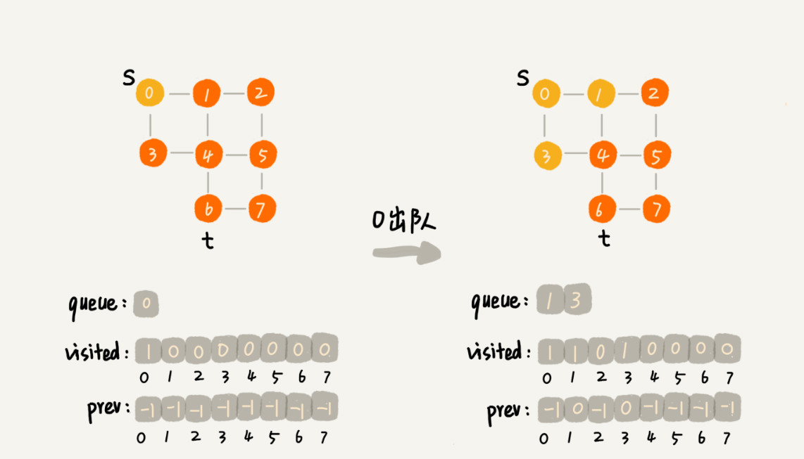
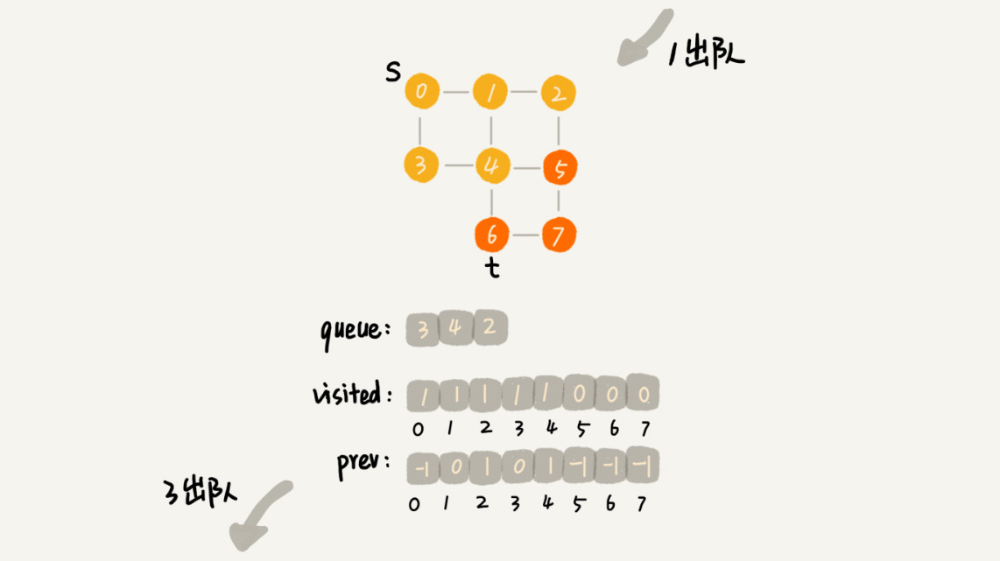
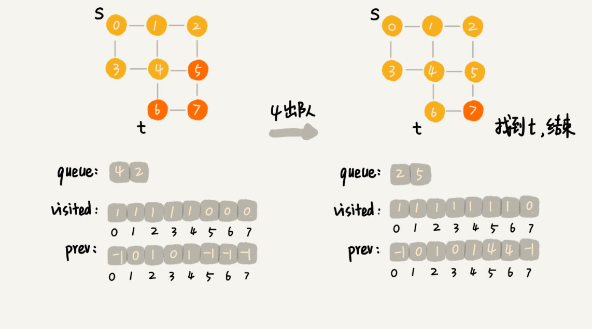

# 31 | 深度和广度优先搜索：如何找出社交网络中的三度好友关系？

## 笔记

### 问题

一个用户, 如何找出这个用户的所有三度(一度, 二度, 三度)的好友关系.

搜索算法

* 深度优先 
* 广度优先

 使用广度优先算法层层遍历, 即可遍历到三度好友关系.

### 什么是"搜索"算法

**算法是作用于具体数据结构之上的**, 深度优先和广度优先算法都是基于"图"这种数据结构的.

图的**表达能力强**, 大部分涉及搜索的场景都可以抽象成图.

图的搜索算法: **在图中找出从一个顶点出发, 到另一个顶点的路径**.

示例:

* 邻接表
* 无向图

```
public class Graph { // 无向图
  private int v; // 顶点的个数
  private LinkedList<Integer> adj[]; // 邻接表

  public Graph(int v) {
    this.v = v;
    adj = new LinkedList[v];
    for (int i=0; i<v; ++i) {
      adj[i] = new LinkedList<>();
    }
  }

  public void addEdge(int s, int t) { // 无向图一条边存两次
    adj[s].add(t);
    adj[t].add(s);
  }
}
```

### 广度优先搜索(`BFS`)

"地毯式"层层推进的搜索策略, 先查找离起始顶点最近的, 然后是次近的, 依次往外搜索.


* `s`表示起点
* `t`表示顶点

搜索一条从`s`到`t`的路径, 求得的路径就是从`s`到`t`的最短路径.

```
public void bfs(int s, int t) {
  if (s == t) return;
  boolean[] visited = new boolean[v];
  visited[s]=true;
  Queue<Integer> queue = new LinkedList<>();
  queue.add(s);
  int[] prev = new int[v];
  for (int i = 0; i < v; ++i) {
    prev[i] = -1;
  }
  while (queue.size() != 0) {
    int w = queue.poll();
   for (int i = 0; i < adj[w].size(); ++i) {
      int q = adj[w].get(i);
      if (!visited[q]) {
        prev[q] = w;
        if (q == t) {
          print(prev, s, t);
          return;
        }
        visited[q] = true;
        queue.add(q);
      }
    }
  }
}

private void print(int[] prev, int s, int t) { // 递归打印s->t的路径
  if (prev[t] != -1 && t != s) {
    print(prev, s, prev[t]);
  }
  System.out.print(t + " ");
}
```

* `visited`: 用来记录已经被访问的顶点, 用来避免顶点被重复访问. 如果顶点`q`被访问, 那响应的`visited[q]`会被设置为`true`
* `queue`: 队列, 用来存储已经被访问, 但相连的顶点还没有被访问的顶点. 广度优先是逐层访问的, 只有把第`k`层的顶点都访问完成之后, 才能访问第`k+1`层的顶点. 我们需要把第`k`层的顶点记录下来, 稍后才能通过第`k`层的顶点来找第`k+1`层的顶点. 用这个队列来实现记录的功能.
* `prev`: 记录搜索路径. 从`s`到`t`, 数组中存储的就是索索的路径, 路径是反向存储的. `prev[w]`存储的是顶点`w`是从哪个前驱顶点遍历过来的. 如通过顶点`2`的邻接表访问到顶点`3`, 那`prev[3]`就等于`2`. 为了正向打印出路径, 需要递归地来打印.







#### 时间和空间复杂度

最坏情况, 终点`t`离`s`很远, 需要遍历完整个图才能找到. 每个顶点都要进出一遍队列, 每个边也都会被访问一次. 搜索的时间复杂度是`O(V+E)`.`V`是顶点的个数,`E`是边的个数. 对于一个**连通图**来说, `E >= (V-1)`. 广度优先搜索的时间复杂度也可以简写为`O(E)`.
 
空间消耗主要在几个辅助变量`visted`数组, `queue`队列, `prev`数组上. 这三个存储空间的大小都不会超过顶点的个数, 空间复杂度是`O(V)`.

### 深度优先搜索(`DFS`)

深度优先搜索(`Depth-First-Search`), 简称`DFS`.

类似走迷宫, 每个岔路口走到底, 知道找到出口.

示例`s -> t`, 找到一条`s`到`t`的路径, 映射到迷宫`s`就是起始所在位置, `t`就是出口.


深度优先搜索使用的是**回溯思想**, 非常适合用递归来实现.

```
boolean found = false; // 全局变量或者类成员变量

public void dfs(int s, int t) {
  found = false;
  boolean[] visited = new boolean[v];
  int[] prev = new int[v];
  for (int i = 0; i < v; ++i) {
    prev[i] = -1;
  }
  recurDfs(s, t, visited, prev);
  print(prev, s, t);
}

private void recurDfs(int w, int t, boolean[] visited, int[] prev) {
  if (found == true) return;
  visited[w] = true;
  if (w == t) {
    found = true;
    return;
  }
  for (int i = 0; i < adj[w].size(); ++i) {
    int q = adj[w].get(i);
    if (!visited[q]) {
      prev[q] = w;
      recurDfs(q, t, visited, prev);
    }
  }
}
```

* `prev`和广度优先类似
* `visited`和广度优先类似
* `found`: 当我们已经找到终止顶点`t`之后, 就不再递归的继续查找了.

#### 时间和空间复杂度

每条边最多会被访问两次, 一次是遍历, 一次是回退. 图上的深度优先搜索算法的时间复杂度是`O(E)`, `E`为边数.

深度优先算法的消耗内存最主要是`visited`, `prev`数组和递归调用栈. `visited, prev`数组的大小跟顶点的个数`v`成正比, 递归调用栈的最大深度不会超过顶点的个数, 总的空间复杂度就是`O(V)`.

### 总结

广度优先和深度优先数据, 简单粗暴属于**暴力搜索算法**.

### 广度优先算法

地毯式层层推进, 从其实顶点开始, 依次往外遍历. 需要借助队列来实现, 遍历得到的路径就是, 起始顶点到终止顶点的最短路径.


## 扩展

### 连通图

一个图中的所有顶点都是连通的.