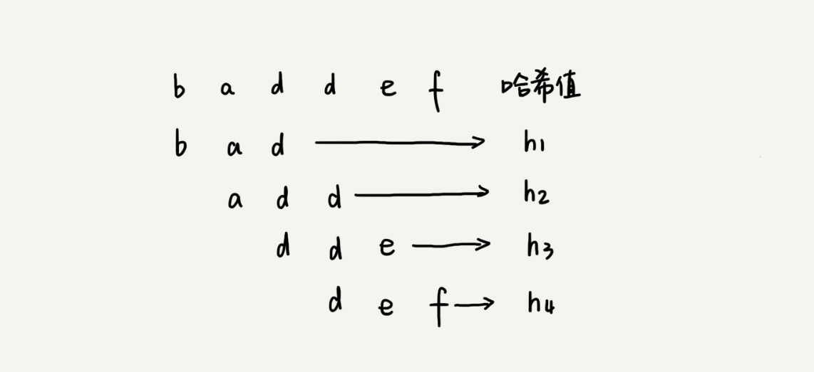
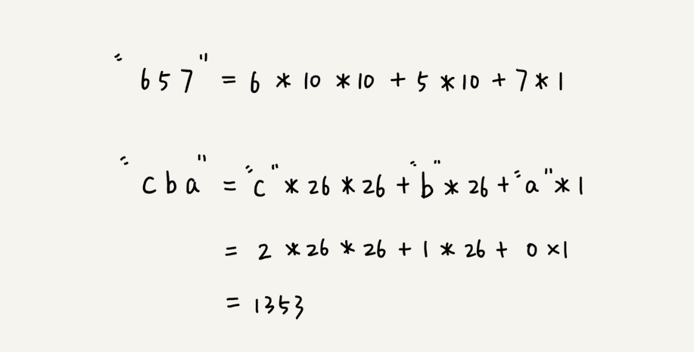

# 32 | 字符串匹配基础（上）：如何借助哈希算法实现高效字符串匹配？

## 笔记

单模式匹配的算法, 一个串跟一个串进行匹配.

### BF 算法

`Brute Force`, 暴力匹配算法, 也叫做朴素匹配算法.

在字符串`A`中查找字符串`B`. 

* 字符串`A`就是 **主串**, 主串的长度记做`n`
* 字符串`B`就是 **模式串**, 模式串的长度记做`m`

`n > m`

**BF算法**, 在主串中, 检查起始位置分别是`0, 1, 2 ... n-m`且长度为`m`的`n-m+1`个子串, 看有没有跟模式串匹配的.

极端情况下, 主串是`aaa...aaa`, 模式串是`aaaaab`. 每次都比对`m`个字符, 要对比`n-m+1`次. **最坏情况时间复杂度是`O(n*m)`**.

`BF`算法的时间复杂度很高, 是`O(n*m)`. 但是实际开发中比较常用

1. 实际中, 大部分情况下, 模式串和主串的长度都不会太长. 大部分情况下, 当中途遇到不能匹配的字符的时候, 就可以停止了. 不需要把`m`个字符都比对一下, 理论上最坏情况的时间复杂度是`O(n*m)`, 大部分情况下, 算法执行效率要比这个高.
2. 简单

### RK 算法

`Rabin-Karp`, 对`BF`算法改进, 引入哈希算法, 降低时间复杂度.

通过哈希算法对主串中的`n-m+1`个子串分别求哈希值, 然后逐个与模式串的哈希值比较大小. 如果某个子串的哈希值与模式串相等, 那就说明对应的子串和模式串匹配了. **因为哈希值是一个数字, 数字之间比较想否相等是非常快速的**.

比较效率提高了, 但是在计算哈希值时, 需要遍历子串中的每个字符, 需要提高哈希值算法计算子串哈希值的效率.

如果把`a ~ z`这`26`个字符映射到`0 ~ 25`这个`26`个数字, `a`表示`0`, `b`表示`1`以此类推, `z`表示`25`.

假设字符串中只包含`a ~ z`这`26`个小写字符, 用二十六进制来表示一个字符串, 对应的哈希值就是二十六进制数转换成十进制的结果.

**特点** 相邻两个子串的哈希值计算公式有一定关系.

相邻的两个子串`s[i-1]`和`s[i]`(`i`表示子串的起始位置, 长度都为`m`), 对应的哈希公示有交集, 可以使用`s[i-1]`的哈希值很快的计算出`s[i]`的哈希值.

计算`26^(m-1)`类似这部分计算, 可以提前计算好存到数组里面, 使用的时候从下标取值.

#### 时间复杂度

* 计算子串哈希值(可以通过扫描一遍主串, 计算出所有子串的哈希值), 时间复杂度是`O(n)`.
* 模式串哈希值与子串哈希值之间的比较, 比较的时间复杂度是`O(1)`, 总共需要比较`n-m+1`个子串的哈希值, 时间复杂度是`O(n)`.

#### 哈希冲突

如果模式串很长, 哈希值超过计算机中整型数据的范围.

为了将还细致落在整形数据范围内, 允许哈希冲突. 这个哈希算法如何设计?

哈希冲突, 如改变哈希算法每个字母代表一个数字, 则会导致哈希冲突(a = 1, b = 2) 或者 a, b, c代表素数.

如何解决哈希冲突? 当发现一个子串的哈希值跟模式串的哈希值相等的时候, 只需要再对比一下子串和模式串本身就好了. 如果哈希值不相等, 那肯定就是不匹配, 不用在对比了.

最极端情况下, 冲突很多, 导致`RK`算法时间复杂度退化, 时间复杂度退化成`O(n * m)`. 一般情况下, 冲突不会很多, `RK`算法的效率还是比`BF`算法高.

## 扩展