# 33 | 字符串匹配基础（中）：如何实现文本编辑器中的查找功能？

## 笔记

### BM 算法的核心思想

`BF`和`RK`在模式串和主串的匹配过程中, 模式串在主串中不停地往后滑动. 当遇到不匹配的字符时, `BF`算法和`RK`算法的做法是, 模式串往后滑动一位, 然后从模式串的第一个字符开始重新匹配.

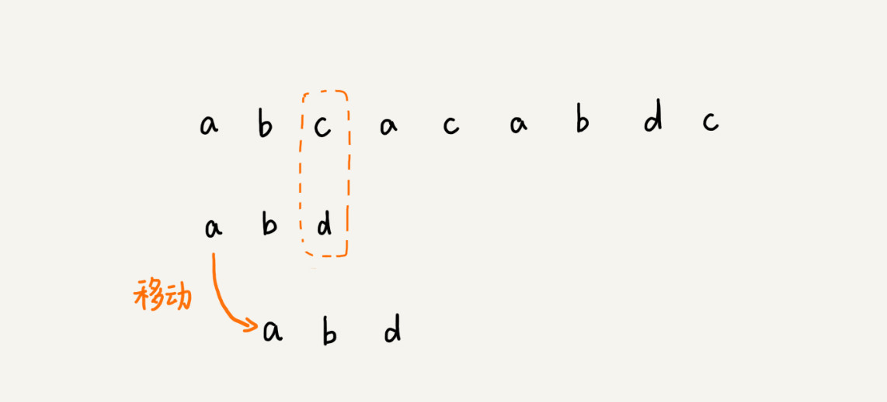

但是因为主串的`c`, 在模式串中是不存在的, 所以, 模式串向后滑动的时候, 只要`c`与模式串与重合, 肯定无法匹配. 所以, 可以一次性把模式串往后滑动几位, 把模式串移动到`c`的后面.

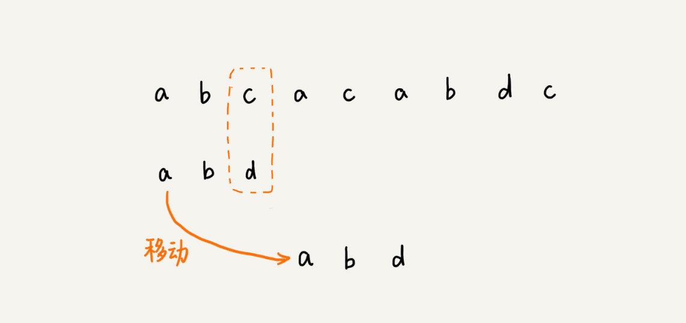

### BM 算法原理分析

**BM算法**包含两部分, **坏字符规则**(`bad character rule`)和**好后缀规则**(`good suffix shift`).

#### 1. 坏字符规则

前面的匹配过程是按模式串中的下标**从小到大**的顺序, 依次与主串中的字符进行匹配.

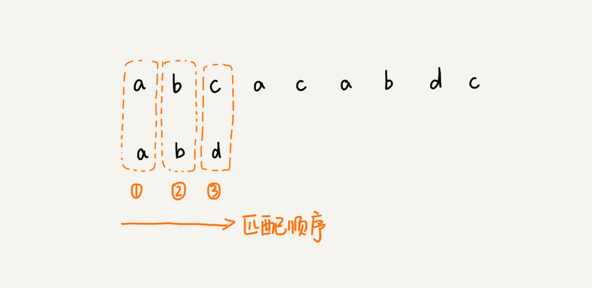

**BM**算法的匹配顺序是按照模式串下标从大到小的顺序, 倒着匹配.

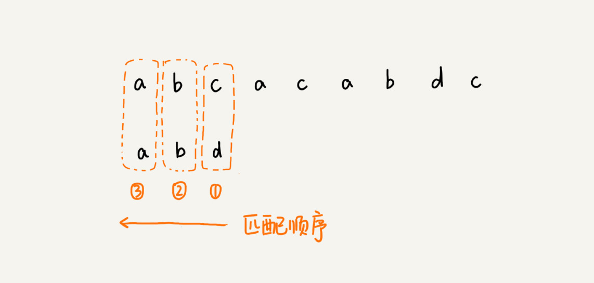

当我们发现某个字符没法匹配的时候. 我们把这个没有匹配的字符叫做**坏字符**(主串中的字符).

拿坏字符`c`在模式串中查找, 发现模式串中并不存在这个字符. 字符`c`与模式串中的任何字符都不可能匹配. 这时, 将模式串直接往后滑动三位, 将模式串滑动到`c`后面的位置, 再从模式串末尾字符开始比较.


这时, 模式串中最后一个字符`d`还是无法跟主串中的`a`匹配. 但是怀字符`a`在模式串中是存在的, 模式串中的小标是`0`的位置也是字符`a`. 这种情况下, 将模式串往后滑动两位, 让两个`a`上下对齐, 然后再从模式串的末尾字符开始, 重新匹配.

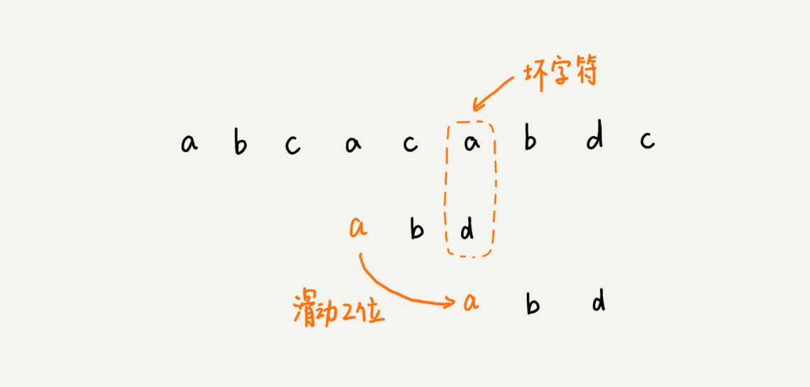

第一次不匹配的时候, 滑动了三位. 第二次不匹配的时候, 将模式串后移两位. 

**移动规律**

* 坏字符对应的模式串中的字符下标记作`si`. 如果坏字符对应的模式串中的下标记做`xi`. 如果不存在, 把`xi`记做`-1`. 那模式串往后移动的位数等于`si-xi`. 如果坏字符在模式串里多处出现, 在计算`xi`的时候, 选择最靠后的那个. 因为这样不会让模式串滑动过多, 导致本来可能匹配的情况被滑动略过.


**最好情况**

最好情况的时间复杂度是`O(n/m)`, 主串是`aaabaaabaaabaaab`, 模式串是`aaaa`. 每次比对都可以直接后移四位.

#### 2. 好后缀规则

如果主串是`aaaaaaaaaaaaaaaa`, 模式串是`baaa`. 根据`si-xi`计算出来的移动位数, 可能是负数. 这里就需要使用"好后缀规则".

当模式串滑动到图中的位置, 模式串和主串有2个字符是匹配的, 倒数第3个字符发生了不匹配的情况.

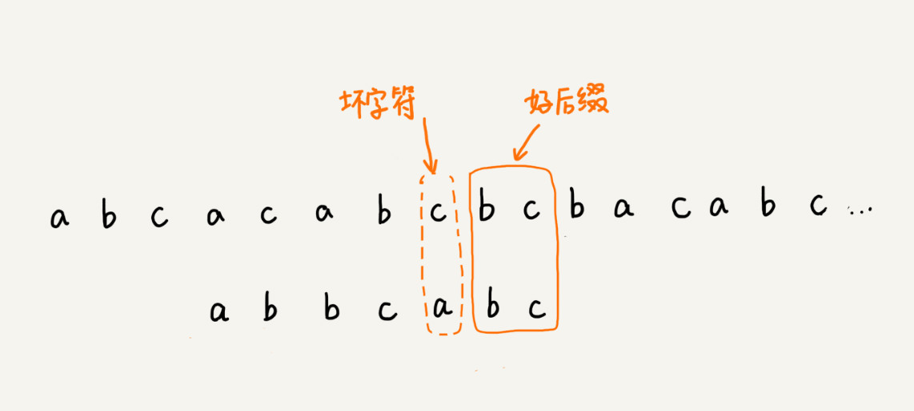

已经匹配的`bc`叫做好后缀, 记做`{u}`. 我们拿它在模式串中查找, 如果招到了另一个跟`{u}`相匹配的子串`{u*}`, 那我们就将模式串滑动到子串`{u*}`与主串中`{u}`对齐的位置.

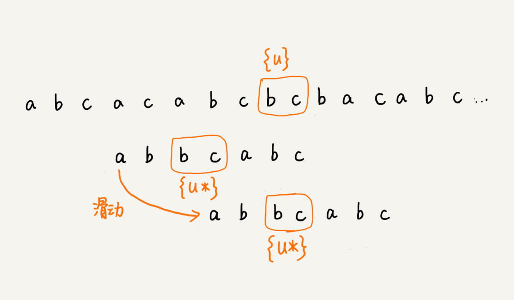

如果在模式串中找不到另一个等于`{u}`的子串, 就直接将模式串, 滑动到主串中`{u}`的后面, 因为之前的任何一次往后滑动, 都没有匹配主串中`{u}`的情况.

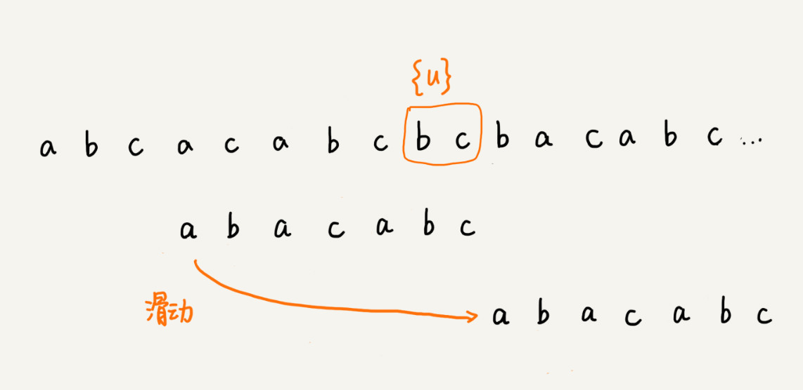

这里`bc`是好后缀, 尽管在模式串中没有另外一个相匹配的子串`{u*}`, 但是如果我们将模式串移动到好后缀额后面, 就会错过模式串和主串可以匹配的情况.

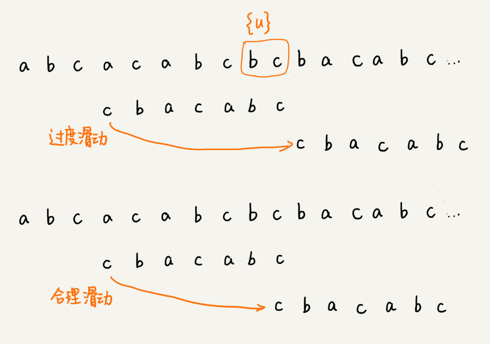

* 如果好后缀在模式中不存在可匹配的子串, 我们一步一步往后滑动模式串的过程中, 只要主串中的`{u}`与模式串有重合, 那肯定就无法完全匹配.
* 档模式串滑动到**前缀**与主串中`{u}`的后缀有部分重合的时候, 并且重合的部分相等的时候, 就有可能会存在完全匹配的情况.

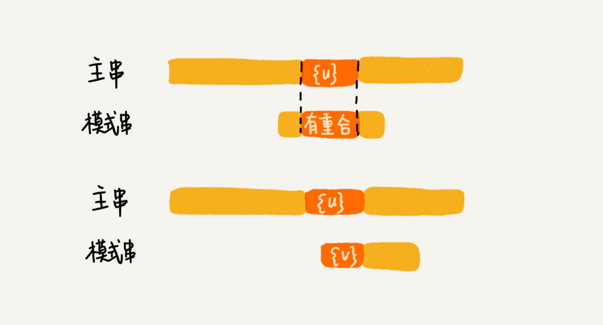

我们不仅要看**好后缀在模式串中, 是否有另一个匹配的子串, 还要看好后缀子串是否存在跟模式串的前缀子串匹配的**.

所谓某个字符串`s`的**后缀**子串, 就是最后一个字符跟`s`对齐的子串, 比如`abc`的后缀子串就包括`c,bc`. 

**前缀**子串, 就是起始字符跟`s`对齐的子串, 比如`abc`的前缀子串有`a, ab`. 

我们从好后缀的后缀子串中, 找一个最长的并且能跟模式串前缀子串匹配的, 假设是`{v}`, 然后将模式串滑动到下面图示的位置.

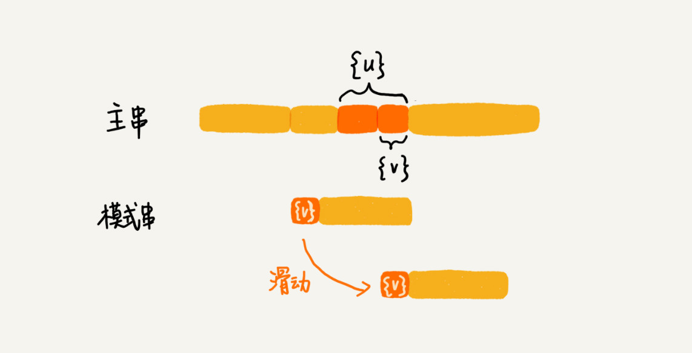

### BM 算法代码实现

**坏字符规则**, 遇到坏字符时, 计算往后移动的位数`si-xi`. 需要求得`xi`. 可以将模式串中的每个字符及其下标都存到散列表中, 这样就可以快速找到坏字符在模式串的位置下标了.

假设字符串的字符集不是很大, 每个字符长度是1字节, 用大小为`256`的数组, 来记录每个字符在模式串中出现的位置. 数组的"下标"对应字符的`ASCII`码值, 数组中存储这个字符在模式串中出现的位置.

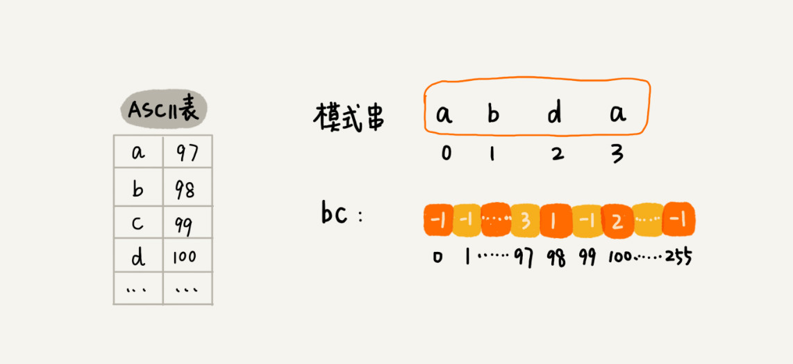

上面的过程翻译成代码, 如下. 其中, 变量`b`是模式串, `m`是模式串的长度, `bc`是散列表.

```
private static final int SIZE = 256; // 全局变量或成员变量
private void generateBC(char[] b, int m, int[] bc) {
  for (int i = 0; i < SIZE; ++i) {
    bc[i] = -1; // 初始化bc
  }
  for (int i = 0; i < m; ++i) {
    int ascii = (int)b[i]; // 计算b[i]的ASCII值
    bc[ascii] = i;
  }
}
```

下面仅考虑坏字符规则, 不考虑`si-xi`计算得到移动位数可能会出现负数的情况.

```
public int bm(char[] a, int n, char[] b, int m) {
  int[] bc = new int[SIZE]; // 记录模式串中每个字符最后出现的位置
  generateBC(b, m, bc); // 构建坏字符哈希表
  int i = 0; // i表示主串与模式串对齐的第一个字符
  while (i <= n - m) {
    int j;
    for (j = m - 1; j >= 0; --j) { // 模式串从后往前匹配
      if (a[i+j] != b[j]) break; // 坏字符对应模式串中的下标是j
    }
    if (j < 0) {
      return i; // 匹配成功，返回主串与模式串第一个匹配的字符的位置
    }
    // 这里等同于将模式串往后滑动j-bc[(int)a[i+j]]位
    i = i + (j - bc[(int)a[i+j]]); 
  }
  return -1;
}
```

## 扩展