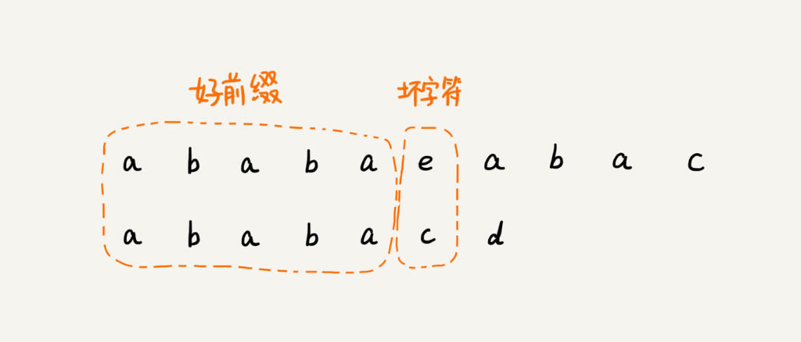
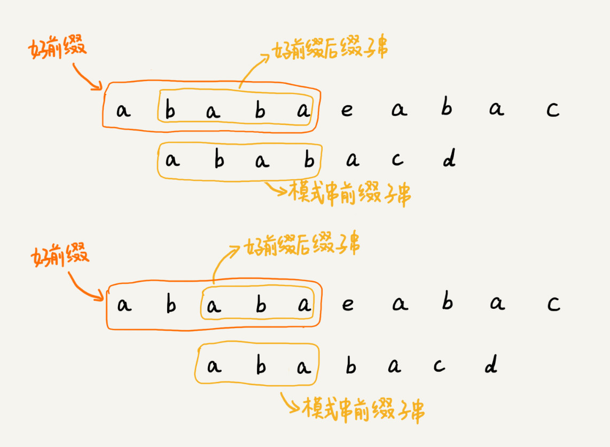

# 34 | 字符串匹配基础（下）：如何借助BM算法轻松理解KMP算法？

## 笔记

### KMP 算法基本原理

**核心思想**. 假设主串是`a`, 模式串是`b`. 在模式串与主串匹配的过程中, 当遇到不可匹配的字符的时候, 希望找到一些规律, 可以将模式串往后滑动几位, 跳过那些肯定不会匹配的情况.

在匹配中, 把不能匹配的那个字符叫做**坏字符**, 已经匹配的字符叫做**好前缀**.

当遇到坏字符的时候, 把模式串往后滑动, 在滑动过程中, 只要模式串和好前缀有上下重合, 前面几个字符比较, 就相当于**拿好前缀的后缀子串, 跟模式串的前缀子串在比较**.

`KMP`算法在试图寻找一种规律: **在模式串和主串的匹配过程中, 当遇到坏字符后, 对于已经比对过的好前缀, 能否找到一种规律, 将模式串一次性滑动很多位?**

## 扩展