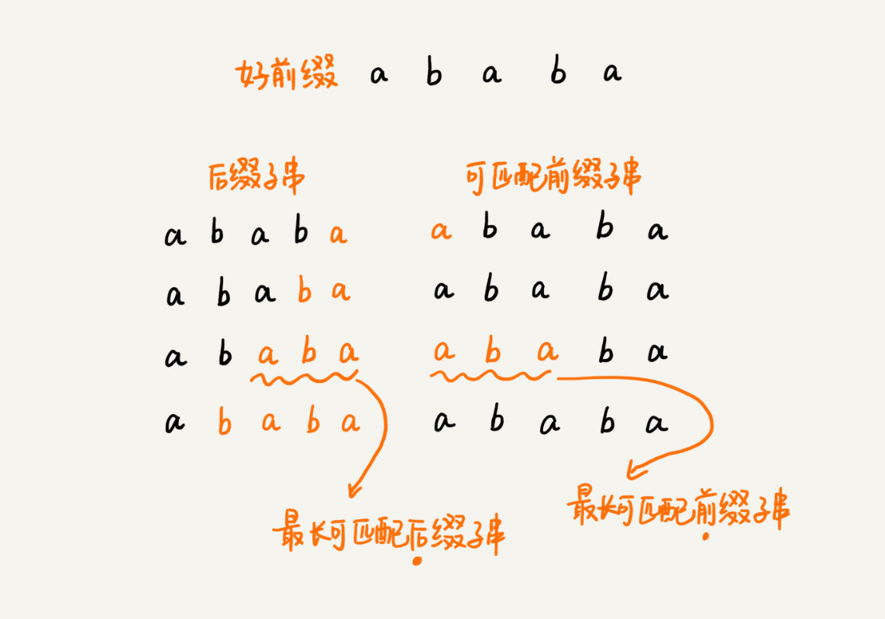
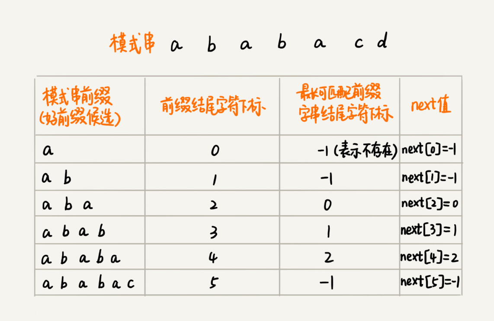
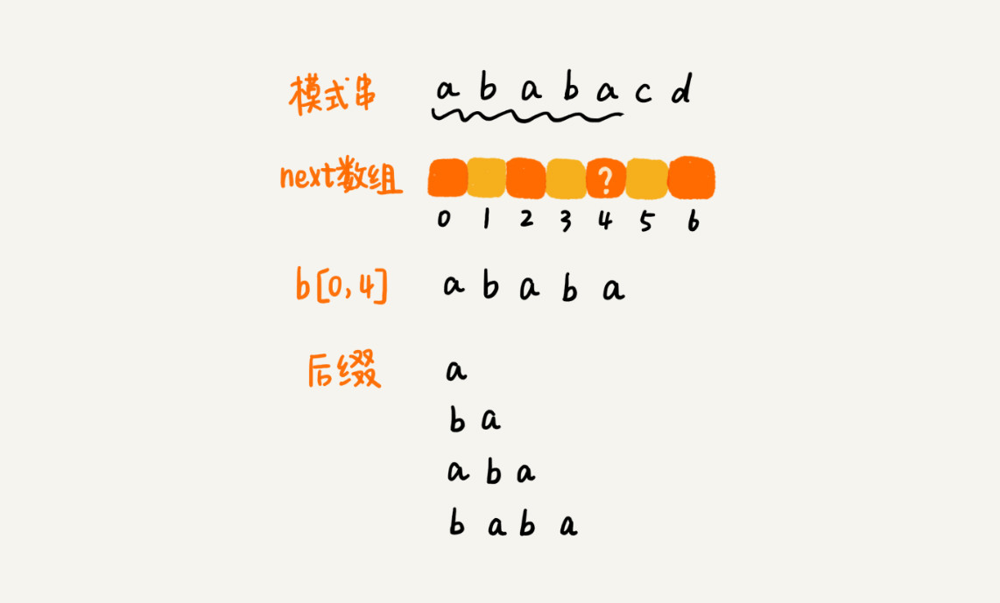
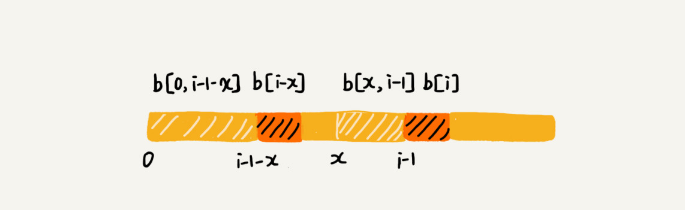

# 34 | 字符串匹配基础（下）：如何借助BM算法轻松理解KMP算法？

## 笔记

### KMP 算法基本原理

**核心思想**. 假设主串是`a`, 模式串是`b`. 在模式串与主串匹配的过程中, 当遇到不可匹配的字符的时候, 希望找到一些规律, 可以将模式串往后滑动几位, 跳过那些肯定不会匹配的情况.

在匹配中, 把不能匹配的那个字符叫做**坏字符**, 已经匹配的字符叫做**好前缀**.


当遇到坏字符的时候, 把模式串往后滑动, 在滑动过程中, 只要模式串和好前缀有上下重合, 前面几个字符比较, 就相当于**拿好前缀的后缀子串, 跟模式串的前缀子串在比较**.


`KMP`算法在试图寻找一种规律: **在模式串和主串的匹配过程中, 当遇到坏字符后, 对于已经比对过的好前缀, 能否找到一种规律, 将模式串一次性滑动很多位?**

拿好前缀本身, 在它的后缀子串中, 查找最长的那个可以跟好前缀的前缀子串匹配的, 假设最长的可匹配的那部分前缀子串是`{v}`, 长度是`k`. 把模式串一次性往后滑动`j-k`位, 相当于, 每次遇到坏字符的时候, 就把`j`更新为`k`, `i`不变, 然后继续比较.


把好前缀的所有后缀子串中, 最长的可匹配前缀子串的那个后缀子串叫做**最长可匹配后缀子串**. 对应的前缀子串, 叫做**最长可匹配前缀子串**.



如何求好前缀的最长可陪陪前缀和后缀子串? 只需要**通过模式串本身就能求解**.

`KMP`算法可以体检构建一个数组, 存储模式串中每个前缀的最长可陪陪前缀子串的结尾字符下标. 数组定义为**next数组**, 也叫**失效函数**.

数组的下标是每个前缀结尾字符下标, 数组的值是这个前缀的最长可以匹配前缀子串的结尾字符下标.



`KMP`算法的框架代码.

```
// a, b分别是主串和模式串；n, m分别是主串和模式串的长度。
public static int kmp(char[] a, int n, char[] b, int m) {
  int[] next = getNexts(b, m);
  int j = 0;
  for (int i = 0; i < n; ++i) {
    while (j > 0 && a[i] != b[j]) { // 一直找到a[i]和b[j]
      j = next[j - 1] + 1;
    }
    if (a[i] == b[j]) {
      ++j;
    }
    if (j == m) { // 找到匹配模式串的了
      return i - m + 1;
    }
  }
  return -1;
}
```

### 失效函数计算方法

`next`数组是如何计算.

**效率比较低的方法**



计算模式串`b`的`next[4]`, 就把`b[0, 4]`的所有后缀子串, 从长到短找出来, 依次查看, 是否能跟模式串的前缀子串匹配.

利用已经计算出来的`next`值, 快速推导出`next[i]`的值.

如果`next[i-1]=k-1`, 也就是说, 子串`b[0, k-1]`是`b[0, k-1]`的最长可匹配前缀子串. 如果子串`b[0, k-1]`的下一个字符`b[k]`, 与`b[0, i-1]`的下一个字符`b[i]`匹配, 那子串`b[0, k]`就是`b[0, i-1]`的最长可匹配前缀子串. 所以, `next[i]`等于`k`. 但是, 如果`b[0, k-1]`的下一个字符`b[k]`跟`b[0, i-1]`的下一个字符`b[i]`不相等呢?


我们假设`b[0, i]`的最长可匹配后缀子串是`b[r, i]`. 如果我们把嘴周一个字符去掉, 那么`b[r, i-1]`肯定是`b[0, i-1]`的可匹配后缀子串, 但不一定是最长可匹配的后缀子串(设模式串好前缀为 "abxabcabxabx"，其最长可匹配后缀子串为 "abx"，去掉最后的字符 'x' 后，虽然 "ab" 还是好前缀的可匹配后缀子串，但 "abxab" 才是最长可匹配后缀子串). 所以, 既然`b[0, i-1]`最长可匹配后缀子串对应的模式串的前缀子串的下一个字符并不等于`b[i]`, 那么我们就可以考察`b[0, i-1]`的次长可匹配后缀子串`b[x, i-1]`对应的可匹配前缀子串`b[0, i-1-x]`的下一个字符`b[i-x]`是否等于`b[i]`. 如果等于, 那么`b[x, i]`就是`b[0, i]`的最长可匹配后缀子串.



如何求得`b[0, i-1]`的次长可匹配后缀子串呢? 次长可匹配后缀子串肯定被包含在最长可匹配后缀子串中, 而最长可匹配后缀子串又对应最长可匹配前缀子串`b[0, y]`. 于是, 查找`b[0, i-1]`的次长可匹配后缀子串, 这个问题就变成, 查找 `b[0, y]`的最长匹配后缀子串的问题了.


可以考察完所有的`b[0, i-1]`的可匹配后缀子串`b[y, i-1]`, 直到找到一个可匹配的后缀子串, 它对应的前缀子串的下一个字符等于`b[i]`, 那这个`b[y, i]`就是`b[0, i]`的最长可匹配后缀子串.

**next算法**

```
// b表示模式串，m表示模式串的长度
private static int[] getNexts(char[] b, int m) {
  int[] next = new int[m];
  next[0] = -1;
  int k = -1;
  for (int i = 1; i < m; ++i) {
    while (k != -1 && b[k + 1] != b[i]) {
      k = next[k];
    }
    if (b[k + 1] == b[i]) {
      ++k;
    }
    next[i] = k;
  }
  return next;
}
```

### KMP 算法复杂度分析

空间复杂度, `KMP`算法只需要一个额外的`next`数组, 数组的大小跟模式串相同. 所以空间复杂度是`O(m)`, `m`表示模式串的长度.

`KMP`算法分为两部分

1. 构建`next`数组
2. 借助`next`数组匹配

时间复杂度**第一部分**, `i`和`k`. `i`从`1`开始一直增加到`m`, 而`k`并不是每次`for`循环都会增加, 所以, `k`累积增加的值肯定小于`m`. 而`while`循环里`k=next[k]`, 实际上是在减小`k`的值, `k`累积都没有增加超过`m`, 所以`while`循环里面`k=next[k]`总的执行次数也不可能超过`m`. 因此, `next`数组计算的时间复杂度是`O(m)`.

时间复杂度**第二部分**, `i`从`0`循环增长到`n-1`, `j`的增长量不可能超过`i`, 所以肯定小于`n`. 而`while`循环中的那条语句`j=next[j-1]+1`, 不会让`j`增长的, 那有没有可能让`j`不变呢? 也没有可能. 因为`next[j-1]`的值肯定小于`j-1`, 所以`while`循环中的这条语句实际上也是在让`j`的值减少. 而`j`总共增长的量都不会超过`n`, 那减少的量也不可能超过`n`, 所以`while`循环中的这条语句总的执行次数也不会超过`n`, 所以这部分的时间复杂度是`O(n)`.

综合两部分的时间复杂度, `KMP`算法的时间复杂度就是`O(m+n)`.

## 扩展

### 1


首先，字符串"BBC ABCDAB ABCDABCDABDE"的第一个字符与搜索词"ABCDABD"的第一个字符，进行比较。因为B与A不匹配，所以搜索词后移一位。

### 2


因为B与A不匹配，搜索词再往后移。

### 3


就这样，直到字符串有一个字符，与搜索词的第一个字符相同为止。

### 4


接着比较字符串和搜索词的下一个字符，还是相同。

### 5


直到字符串有一个字符，与搜索词对应的字符不相同为止。

### 6


这时，最自然的反应是，将搜索词整个后移一位，再从头逐个比较。这样做虽然可行，但是效率很差，因为你要把"搜索位置"移到已经比较过的位置，重比一遍。

### 7


一个基本事实是，当空格与D不匹配时，你其实知道前面六个字符是"ABCDAB"。KMP算法的想法是，设法利用这个已知信息，不要把"搜索位置"移回已经比较过的位置，继续把它向后移，这样就提高了效率。

### 8


怎么做到这一点呢？可以针对搜索词，算出一张《部分匹配表》（Partial Match Table）。

### 9


已知空格与D不匹配时，前面六个字符"ABCDAB"是匹配的。查表可知，**最后一个匹配字符B**对应的"部分匹配值"为2，因此按照下面的公式算出向后移动的位数：

```
移动位数 = 已匹配的字符数 - 对应的部分匹配值
```

### 10


因为空格与Ｃ不匹配，搜索词还要继续往后移。这时，已匹配的字符数为2（"AB"），对应的"部分匹配值"为0。所以，移动位数 = 2 - 0，结果为 2，于是将搜索词向后移2位。

### 11


因为空格与A不匹配，继续后移一位。

### 12


逐位比较，直到发现C与D不匹配。于是，移动位数 = 6 - 2，继续将搜索词向后移动4位。

### 13


逐位比较，直到搜索词的最后一位，发现完全匹配，于是搜索完成。如果还要继续搜索（即找出全部匹配），移动位数 = 7 - 0，再将搜索词向后移动7位，这里就不再重复了。

### 部分匹配表


"前缀"指除了最后一个字符以外，一个字符串的全部头部组合；"后缀"指除了第一个字符以外，一个字符串的全部尾部组合。


"部分匹配值"就是"前缀"和"后缀"的最长的共有元素的长度。以"ABCDABD"为例，

```
－　"A"的前缀和后缀都为空集，共有元素的长度为0；

－　"AB"的前缀为[A]，后缀为[B]，共有元素的长度为0；

－　"ABC"的前缀为[A, AB]，后缀为[BC, C]，共有元素的长度0；

－　"ABCD"的前缀为[A, AB, ABC]，后缀为[BCD, CD, D]，共有元素的长度为0；

－　"ABCDA"的前缀为[A, AB, ABC, ABCD]，后缀为[BCDA, CDA, DA, A]，共有元素为"A"，长度为1；

－　"ABCDAB"的前缀为[A, AB, ABC, ABCD, ABCDA]，后缀为[BCDAB, CDAB, DAB, AB, B]，共有元素为"AB"，长度为2；

－　"ABCDABD"的前缀为[A, AB, ABC, ABCD, ABCDA, ABCDAB]，后缀为[BCDABD, CDABD, DABD, ABD, BD, D]，共有元素的长度为0。
```


**"部分匹配"**的实质是，有时候，字符串头部和尾部会有重复。比如，"ABCDAB"之中有两个"AB"，那么它的"部分匹配值"就是2（"AB"的长度）。搜索词移动的时候，**第一个"AB"向后移动4位（字符串长度-部分匹配值），就可以来到第二个"AB"的位置**。