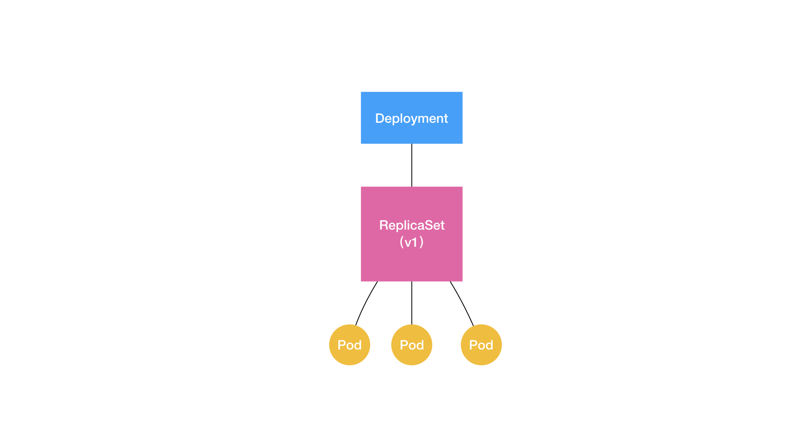

# 17 | 经典PaaS的记忆：作业副本与水平扩展

## 笔记

`Deployment`实际上, 它实现了`Kubernetes`项目中一个非常重要的功能**Pod 的"水平扩展/收缩"(horizontal scaling out/in)**

`Depolyment`需要遵循"滚动更新"(`rolling update`)的方式, 来升级所有的容器. 这个能力的实现依赖的是**ReplicaSet**.

```
apiVersion: apps/v1
kind: ReplicaSet
metadata:
  name: nginx-set
  labels:
    app: nginx
spec:
  replicas: 3
  selector:
    matchLabels:
      app: nginx
  template:
    metadata:
      labels:
        app: nginx
    spec:
      containers:
      - name: nginx
        image: nginx:1.7.9
```

**一个ReplicaSet对象, 其实就是由副本数目的定义和一个Pod模板组成的**, `Deployment`控制器实际操作的, 就是这样的`ReplicaSet`对象, 而不是`Pod`对象.

一个`Deployment`所管理的`Pod`, 它的`ownerReference`是`ReplicaSet`

**Deployment, RelicaSet 和 Pod的关系**是一种层层控制关系



`ReplicaSet`负责通过"控制器模式", 保证系统中的`Pod`的个数永远等于指定个数. `Deployment`只允许容器的`restartPolicy=Always`, 因为只有在容器能保证自己始终是`Running`状态的前提下, `ReplicaSet`调整`Pod`的个数才有意义.

`Deployment`同样通过"控制器模式"，来操作`ReplicaSet`的个数和属性，进而实现"水平扩展 / 收缩"和"滚动更新"这两个编排动作. 

**水平控制和收缩**`Deployment Controller`只需要修改它所控制的`ReplicaSet`的`pod`副本个数就可以了.

**滚动更新**

```
$ kubectl get deployments
NAME               DESIRED   CURRENT   UP-TO-DATE   AVAILABLE   AGE
nginx-deployment   3         0         0            0           1s
```

* `DESIRED`: 用户期望的`Pod`副本个数(`spec.replicase`的值)
* `CURRENT`: 当前处于`Running`状态的`Pod`的个数.
* `UP-TO-DATE`: 电气概念处于最新版本的`Pod`的个数(`Pod`的`Spec`部分与`Deployment`里`Pod`模板里定义的完全一致).
* `AVAILABLE`: 当前已经可用的`Pod`的个数. 是`Running`状态, 又是最新版, 并且已经处于`Ready`(健康检查正确)状态的`Pod`的个数.

`kubectl rollout status`可以实时查看`Deployment`对象的状态变化.

用户提交了一个`Deployment`对象后, `Deployment Controller`会立即创建一个`Pod`副本个数为`3`的`ReplicaSet`. 这个`ReplicaSet`的名字, 则是由`Deployment`的名字和一个随机字符串共同完成. 这个随机字符串叫做**pod-template-hash**, `ReplicaSet`会把这个随机字符串加在它所控制的`Pod`的标签里面, 从而保证`Pod`的唯一.

```
$ kubectl get rs
NAME                          DESIRED   CURRENT   READY   AGE
nginx-deployment-3167673210   3         3         3       20s
```

**Deployment只是在ReplicaSet的基础上, 添加了 UP-TO-DATE 这个跟版本有关的状态字段**

`kubectl edit`只是把`API`对象的内容下载到了本地文件, 修改完成后再提交上去.

滚动更新的过程:

```
$ kubectl describe deployment nginx-deployment
...
Events:
  Type    Reason             Age   From                   Message
  ----    ------             ----  ----                   -------
...
  Normal  ScalingReplicaSet  24s   deployment-controller  Scaled up replica set nginx-deployment-1764197365 to 1
  Normal  ScalingReplicaSet  22s   deployment-controller  Scaled down replica set nginx-deployment-3167673210 to 2
  Normal  ScalingReplicaSet  22s   deployment-controller  Scaled up replica set nginx-deployment-1764197365 to 2
  Normal  ScalingReplicaSet  19s   deployment-controller  Scaled down replica set nginx-deployment-3167673210 to 1
  Normal  ScalingReplicaSet  19s   deployment-controller  Scaled up replica set nginx-deployment-1764197365 to 3
  Normal  ScalingReplicaSet  14s   deployment-controller  Scaled down replica set nginx-deployment-3167673210 to 0
```

* `hash= 1764197365`, 创建一个新的`ReplicaSet`, 这个新的`ReplicaSet`的初始`Pod`副本数是`0`.
* `Age=24s`, `Deployment Controller`将这个新的`ReplicaSet`所控制的`Pod`副本数从`0`变成`1`个. **水平扩展**出一个副本.
* `Age=22`, `Deployment Controller`把旧的`ReplicaSet`(hash=3167673210)锁控制的旧`Pod`副本数减少一个. **水平收缩**成两个副本.
* 如此交替进行

**将一个集群正在运行的多个`Pod`版本, 交替地注意升级的过程, 就是"滚动更新"**

滚动更新完成之后, 新旧两个`ReplicaSet`的最终状态:

```
$ kubectl get rs
NAME                          DESIRED   CURRENT   READY   AGE
nginx-deployment-1764197365   3         3         3       6s
nginx-deployment-3167673210   0         0         0       30s
```

`Deployment Controller`会确保, 在任何时间窗口内只有指定比例的`Pod`处于离线状态. 也会确保, 只有指定比例的新`Pod`被创建出来. 这两个比例的值都是可以被配置的, 默认的都是`DESIRED`值的**25%**. 这个策略, 是`Deployment`对象的一个字段, 名叫`RollingUpdateStrategy`, 如下所示:

```
apiVersion: apps/v1
kind: Deployment
metadata:
  name: nginx-deployment
  labels:
    app: nginx
spec:
...
  strategy:
    type: RollingUpdate
    rollingUpdate:
      maxSurge: 1
      maxUnavailable: 1
```

* `maxSurge`: 除了 DESIRED 数量之外，在一次“滚动”中，Deployment 控制器还可以创建多少个新 Pod.
* `maxUnavailable`: 指的是，在一次"滚动"中, Deployment 控制器可以删除多少个旧 Pod.

还可以用百分比来表示, 如: `maxUnavailable=50%`, 表示最多可以一次删除"50%*DESIRED数量"个Pod.


`Deployment`的控制器, **实际上控制的是`ReplicaSet`的数目, 以及每个`ReplicaSet`的属性**

一个应用的版本, 对应的正是一个`ReplicaSet`; 这个版本应用的`Pod`数量, 则由`ReplicaSet`通过它自己的控制器(`ReplicaSet Controller`)来保证.

**通过这样的多个ReplicaSet对象, Kubernetes项目就实现了对多个"应用版本"的描述"

**Deployment 对应用进行版本控制的具体原理**

`--record`, 记录下每次操作所执行的命令, 以方便后面查看.

`kubectl rollout history`, 查看每次`Deployment`变更对应的版本.

`kubectl rollout undo`命令最后, 加上要回滚到的指定版本的版本号, 就可以回滚到指定版本了.

问题: 每次对`Deployment`的每一次更新操作, 都会成成一个新的`ReplicaSet`对象, 有些多余, 浪费资源.

`kubectl rollout pause`, 让这个`Deployment`进入一个"暂停"状态. 可以随意使用`kubectl edit`或者`kubectl set image`指令, 修改这个`Deployment`的内容. 此时`Deployment`正处于"暂停"状态, **我们对 Deployment 的所有修改, 都不会触发新的"滚动更新", 也不会创建新的 ReplicaSet **.

操作完成之后, 执行`kubectl rollout resume`, 可以把这个`Deployment`"恢复"回来.

**在这个 kubectl rollout resume 指令执行之前, 在 kubectl rollout pause 指令之后的这段时间里, 我们对 Deployment 进行的所有修改，最后只会触发一次"滚动更新"**

`Deployment`对象有一个字段, 叫作`spec.revisionHistoryLimit`, 就是`Kubernetes`为`Deployment`保留的"历史版本"个数.

### 总结

`Deployment`实际上是一个**两层控制器**, 通过`ReplicaSet`的个数来描述应用的版本. 再通过`ReplicaSet`的属性, 来保证`Pod`的副本数量.

**Deployment 控制 ReplicaSet（版本），ReplicaSet 控制 Pod（副本数）**

## 扩展