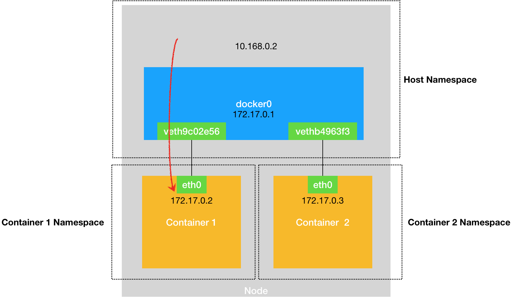
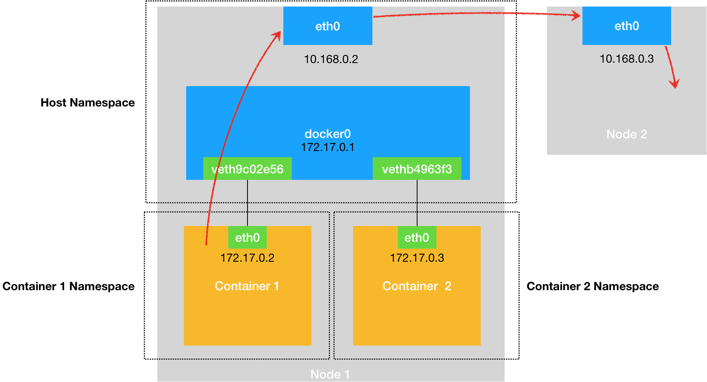
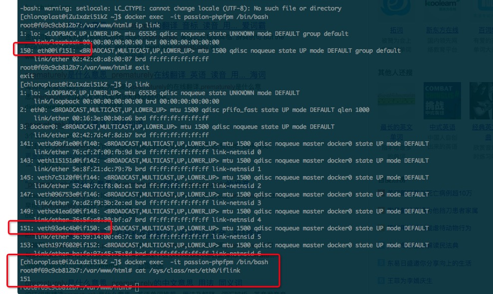

# 32 | 浅谈容器网络

## 笔记

一个`Linux`容器能看见的"网络栈", 实际上是被隔离在它自己的`Network Namespace`当中的.

网络栈包括了:

* 网卡(`Network Interface`)
* 回环设备(`Loopback Device`)
* 路由表(`Routing Table`)
* `iptables`规则

容器可以声明直接使用宿主机的网络栈(`--net=host`), 即: 不开启`Network Namespace`, 如:

```
$ docker run –d –net=host --name nginx-host nginx
```

以为容器提供良好的网络性能, 但是会引入共享网络资源的问题, 如端口冲突.

**一般, 我们会希望容器进程使用自己`Network Namespace`里的网络栈, 即: 拥有自己的 IP 地址和端口**

**问题?**, 被隔离的容器进程, 该如何跟其他`Network Namespace`里的容器进程进行交互?

可以把每一个容器看做一台主机, 都有一套独立的"网络栈".

* 两台主机通信, 把它们用一根网线连接起来
* 多台主机之间通信, 用网线, 把它们连接在一台交换机上

`Linux`中, **网桥(`Bridge`)**是虚拟交换机作用的网络设备. 是一个工作在数据链路层(`Data Link`)的设备, 主要功能是根据`MAC`地址学习来将数据包转发到网桥的不同端口(`Port`)上.

`Docker`项目会默认在宿主机上创建一个名叫`docker0`的网桥, **凡是连接在`docker0`网桥上的容器, 就可以通过它来进行通信**.

使用`Veth Pair`的虚拟设备"连接"到`docker0`网桥上.

`VethPair`设备的特点是: 它被创建出来后, 总是以两张虚拟网卡(`Veth Peer`)的形式成对出现. **从其中一个"网卡"发出的数据包, 可以直接出现在与它对应的另一张"网卡"上, 哪怕这两个"网卡"在不同的`Network Namepsace`里**.

`Veth Pair`常常被用作**连接不同`Network Namespace`的"网线"**.

启动`nginx-1`的容器:

```
$ docker run –d --name nginx-1 nginx
```

查看网络设备

```
# 在宿主机上
$ docker exec -it nginx-1 /bin/bash
# 在容器里
root@2b3c181aecf1:/# ifconfig
eth0: flags=4163<UP,BROADCAST,RUNNING,MULTICAST>  mtu 1500
        inet 172.17.0.2  netmask 255.255.0.0  broadcast 0.0.0.0
        inet6 fe80::42:acff:fe11:2  prefixlen 64  scopeid 0x20<link>
        ether 02:42:ac:11:00:02  txqueuelen 0  (Ethernet)
        RX packets 364  bytes 8137175 (7.7 MiB)
        RX errors 0  dropped 0  overruns 0  frame 0
        TX packets 281  bytes 21161 (20.6 KiB)
        TX errors 0  dropped 0 overruns 0  carrier 0  collisions 0
        
lo: flags=73<UP,LOOPBACK,RUNNING>  mtu 65536
        inet 127.0.0.1  netmask 255.0.0.0
        inet6 ::1  prefixlen 128  scopeid 0x10<host>
        loop  txqueuelen 1000  (Local Loopback)
        RX packets 0  bytes 0 (0.0 B)
        RX errors 0  dropped 0  overruns 0  frame 0
        TX packets 0  bytes 0 (0.0 B)
        TX errors 0  dropped 0 overruns 0  carrier 0  collisions 0
        
$ route
Kernel IP routing table
Destination     Gateway         Genmask         Flags Metric Ref    Use Iface
default         172.17.0.1      0.0.0.0         UG    0      0        0 eth0
172.17.0.0      0.0.0.0         255.255.0.0     U     0      0        0 eth0
```

其中一张`eth0`的网卡, 正是一个`Veth Pair`设备在容器里的这一端.

查看路由表, `eth0`网卡是这个容器里的默认路由设备. 所有对`172.17.0.0/16`也会被交给`eth0`来处理(第二条`172.17.0.0`路由规则).

这个`Veth Pair`设备的另一端, 则在宿主机上. 可以通过查看宿主机的网络设备看到它.

```
# 在宿主机上
$ ifconfig
...
docker0   Link encap:Ethernet  HWaddr 02:42:d8:e4:df:c1  
          inet addr:172.17.0.1  Bcast:0.0.0.0  Mask:255.255.0.0
          inet6 addr: fe80::42:d8ff:fee4:dfc1/64 Scope:Link
          UP BROADCAST RUNNING MULTICAST  MTU:1500  Metric:1
          RX packets:309 errors:0 dropped:0 overruns:0 frame:0
          TX packets:372 errors:0 dropped:0 overruns:0 carrier:0
 collisions:0 txqueuelen:0 
          RX bytes:18944 (18.9 KB)  TX bytes:8137789 (8.1 MB)
veth9c02e56 Link encap:Ethernet  HWaddr 52:81:0b:24:3d:da  
          inet6 addr: fe80::5081:bff:fe24:3dda/64 Scope:Link
          UP BROADCAST RUNNING MULTICAST  MTU:1500  Metric:1
          RX packets:288 errors:0 dropped:0 overruns:0 frame:0
          TX packets:371 errors:0 dropped:0 overruns:0 carrier:0
 collisions:0 txqueuelen:0 
          RX bytes:21608 (21.6 KB)  TX bytes:8137719 (8.1 MB)
          
$ brctl show
bridge name bridge id  STP enabled interfaces
docker0  8000.0242d8e4dfc1 no  veth9c02e56
```

`nginx-1`容器对应的`Veth Pair`设备, 在宿主机上是一张虚拟网卡. 名字叫做`veth9c02e56`. 通过`brctl show`的输出, 可以看到这张网卡被"插"在了`docker 0`上.

启动另外一个容器`nginx-2`.

```
$ docker run –d --name nginx-2 nginx
$ brctl show
bridge name bridge id  STP enabled interfaces
docker0  8000.0242d8e4dfc1 no  veth9c02e56
       vethb4963f3
```

另一个虚拟网卡`vethb4963f3`, 也被"插"在了`docker0`网桥上.

在容器`nginx-1`里面`ping`容器`nginx-2`的`IP`地址, 可以`ping`通.

**原理**

在`nginx-1`访问`nginx-2`容器里的`IP`地址(`172.17.0.3`), 这个目的`IP`地址会匹配到`nginx-1`容器里的第二条路由规则. 这条路由规则的网关(`Gateway`)是`0.0.0.0`, 意味着是一条**直连规则**, 凡是匹配到这条规则的`IP`包, 应该经过本机的`eth0`网卡, 通过二层网络直接发往目的主机.

通过二层网络到达`nginx-2`容器, 需要有`172.17.0.3`这个`IP`对应的`MAC`地址. 所以`nginx-1`容器的网络协议栈, **需要通过`eth0`网卡发送一个`ARP`广播, 来通过`IP`地址查找对应的`MAC`地址**.

`eth0`网卡, 是一个`Veth Pair`, 一端在`nginx-1`容器的`Network Namespace`里, 另一端位于宿主机上(`Host Namespace`), 被"插"在宿主机`docker0`**网桥**上.

一旦一张虚拟网卡被"插"在网桥上, 就会变成该网桥的"从设备". 从设备会被**剥夺**调用网络协议栈处理数据包的资格, **降级**称为网桥上的一个端口. 这个端口唯一的作用, 就是接收流入的数据包, 然后**把这些数据包的"生杀大权"(转发或者丢弃), 全部交给对应的网桥**

**收到`ARP`请求之后, `docker0`网桥就会扮演二层交换机的角色, 把`ARP`广播转发哦到其他被"插"在`docker0`上的虚拟网卡上**. 这样, 同样连接在`docker0`上的`nginx-2`容器的网络协议栈就会收到`ARP`请求, 从而将`172.17.0.3`所对应的`MAC`地址回复给`nginx-1`容器.

有了`MAC`地址, `nginx-1`容器的`eth0`网卡就可以将数据包发出去.

根据`Veth Pair`设备的原理, 这个数据包会立刻出现在宿主机上的`veth9c02e56`虚拟网卡上. 不过此时这个`veth9c02e56`网卡的网络协议栈的资格已经被"剥夺", 所以这个数据包就直接流入到了`docker0`网桥里.

`docker0`处理转发的过程, 继续扮演二层交换机的角色. `docker0`网桥根据数据包的目的`MAC`地址(`nginx-2`容器的`MAC`地址), 在它的`CAM`表(交换机通过`MAC`地址学习维护的端口和`MAC`地址的对应表)里查到对应的端口(`Port`)为:`vethb4963f3`, 然后把数据包发往这个端口.

`vethb4963f3`是`nginx-2`容器"插"在`docker0`网桥上的另一块虚拟网卡, 它也是一个`Veth Pair`设备. 这样, 数据包就进入到了`nginx-2`容器的`Network Namespace`里.

`nginx-2`容器看到的情况是, 它自己的`eth0`网卡上出现了流入的数据包. 这样`nginx-2`的网络协议栈救护对请求进行处理, 最后将相应(`Pong`)返回到`nginx-1`.

**同一个宿主机上不同容器通过`docker0`网桥进行通信的流程**


可以通过`TRACE`功能在`/var/log/syslog`查看数据包的传输过程.

```
# 在宿主机上执行
$ iptables -t raw -A OUTPUT -p icmp -j TRACE
$ iptables -t raw -A PREROUTING -p icmp -j TRACE
```

**被限制在Network Namespace里的容器进程, 实际上是通过 Veth Pair 设备 + 宿主机网桥的方式, 实现了跟其他容器的数据交换**.

在一台宿主机上, 访问该宿主机上的容器的`IP`地址时, 这个请求的数据包, 根据路由规则到达`docker0`网桥, 然后被转发到对应的`Veth Pair`设备, 最后出现在容器里.



```
d[chloroplast@iZu1xdzi51kZ ~]$ docker ps
CONTAINER ID        IMAGE                                                                COMMAND                  CREATED             STATUS              PORTS                NAMES
453cdd7456e9        registry.cn-hangzhou.aliyuncs.com/nginx-phpfpm/nginx-front:passion   "nginx -g 'daemon off"   2 weeks ago         Up 2 weeks          0.0.0.0:80->80/tcp   passion-nginx
f69c9cb812b7        registry.cn-hangzhou.aliyuncs.com/phpfpm/phpfpm-front:1.3            "docker-php-entrypoin"   2 weeks ago         Up 2 weeks          9000/tcp             passion-phpfpm
37ed5cf4c6e1        registry.aliyuncs.com/marmot/memcached                               "/entrypoint.sh memca"   2 weeks ago         Up 2 weeks          11211/tcp            passion-memcached2
f08d21ce6bde        registry.aliyuncs.com/marmot/memcached:1.0                           "docker-entrypoint.sh"   2 weeks ago         Up 2 weeks          11211/tcp            chloroplast_memcached-session-2_1
57ab6f6ee99d        registry.aliyuncs.com/marmot/mysql:5.6                               "docker-entrypoint.sh"   2 weeks ago         Up 2 weeks          3306/tcp             passion-mysql-master
99f1f532df7d        registry.aliyuncs.com/marmot/memcached:1.0                           "docker-entrypoint.sh"   2 weeks ago         Up 2 weeks          11211/tcp            chloroplast_memcached-session-1_1
01e98541fce9        registry.aliyuncs.com/marmot/memcached                               "/entrypoint.sh memca"   2 weeks ago         Up 2 weeks          11211/tcp            passion-memcached1
[chloroplast@iZu1xdzi51kZ ~]$ docker exec  -it passion-phpfpm /bin/bash
root@f69c9cb812b7:/var/www/html# ip addr
1: lo: <LOOPBACK,UP,LOWER_UP> mtu 65536 qdisc noqueue state UNKNOWN group default
    link/loopback 00:00:00:00:00:00 brd 00:00:00:00:00:00
    inet 127.0.0.1/8 scope host lo
       valid_lft forever preferred_lft forever
    inet6 ::1/128 scope host
       valid_lft forever preferred_lft forever
150: eth0@if151: <BROADCAST,MULTICAST,UP,LOWER_UP> mtu 1500 qdisc noqueue state UP group default
    link/ether 02:42:c0:a8:00:07 brd ff:ff:ff:ff:ff:ff
    inet 192.168.0.7/20 scope global eth0
       valid_lft forever preferred_lft forever
    inet6 fe80::42:c0ff:fea8:7/64 scope link
       valid_lft forever preferred_lft forever
root@f69c9cb812b7:/var/www/html# exit
exit

[chloroplast@iZu1xdzi51kZ ~]$ ping 192.168.0.7
PING 192.168.0.7 (192.168.0.7) 56(84) bytes of data.
64 bytes from 192.168.0.7: icmp_seq=1 ttl=64 time=0.049 ms
64 bytes from 192.168.0.7: icmp_seq=2 ttl=64 time=0.029 ms
^C
--- 192.168.0.7 ping statistics ---
2 packets transmitted, 2 received, 0% packet loss, time 999ms
rtt min/avg/max/mdev = 0.029/0.039/0.049/0.010 ms
```

当一个容器试图连接到另一个宿主机时, 比如`ping 10.168.0.3`, 它发出的请求数据包,  首先经过`docker0`网桥出现在宿主机上. 然后根据宿主机的路由表里的直联路由规则(`10.168.0.0/24 via eth0`), 对 `10.168.0.3`的访问请求就会交给宿主机的`eth0`处理.

接下来, 这个数据包就会经过宿主机的`eth0`网卡转发到宿主机网络上, 最终到达`10.168.0.3`对应的宿主机上(这个过程的实现要求这两台宿主机本身是连通的).



**当容器连不通外网的时候, 先试试`docker0`网桥能不能`ping`通, 然后查看一下跟`docker 0`和`Veth Pair`设备相关的`iptables`规则是不是有异常**.

### 跨主通信

默认情况下, 不同宿主的`docker0`网桥是不连通的, 连接在这些网桥上的容器, 无法进行通信.

可以创建一个整个集群"公用"的网桥, 然后把集群里的所有容器都连接到这个网桥上, 可以可以互相通信了.


**核心**: 需要在已有的宿主机网络上, 再通过软件构建一个覆盖在已有宿主机网络之上的, 可以把所有容器连通在一起的虚拟网络. 这种技术被称为**Overlay Network**(覆盖网络).

这个`Overlay Netowrk`本身, 由每台宿主机上的一个"特殊网桥"共同组成. 如`Node1.container1`访问`Node2.container3`. `Node1`上的"特殊网桥"在收到数据包之后, 可以通过某种方式, 把数据吧发送到正确的宿主机, 如`Node 2`. 在`Node 2`上的”特殊网桥"收到数据包后, 可以通过某种方式, 把数据包转发给正确的容器, 如`container3`.

**甚至**, 每台宿主机上, 不需要有一个特殊的网桥, 仅仅通过某种方式配置宿主机路由表, 就能够把数据包转发到正确的宿主机上.

## 扩展

`iflink`查找对应的`veth`设备关系



### 网桥

`Linux`中, **网桥(`Bridge`)**是虚拟交换机作用的网络设备. 是一个工作在数据链路层(`Data Link`)的设备, 主要功能是根据`MAC`地址学习来将数据包转发到网桥的不同端口(`Port`)上.