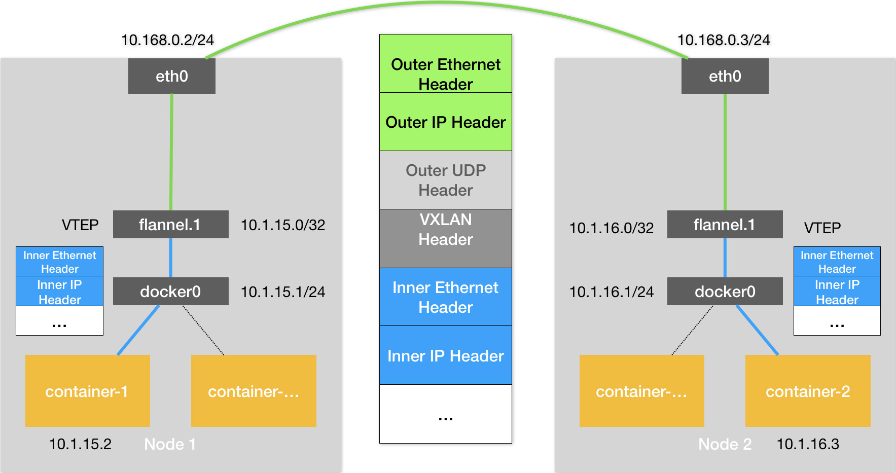
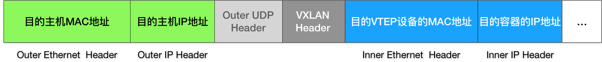

# 33 | 深入解析容器跨主机网络

## 笔记

### Flannel

`Flannel`本身是一个框架, `Flannel`的后端提供容器网络功能. 目前支持三种后端实现:

* `VXLAN`
* `host-gw`
* `UDP`

#### UDP

性能最差, 最直接, 最简单.

**前提**

* 宿主机`Node1`有容器`container-1`, 它的`IP`地址是`100.96.1.2`, 对应的`docker0`网桥的地址是`100.96.1.1/24`
* 宿主机`Node2`有容器`container-2`, 它的`IP`地址是`100.96.2.3`, 对应的`docker0`网桥的地址是`100.96.2.1/24`

**目标** 让`container-1`访问`container-2`.

`container-1`容器里的进程发起`IP`包, 源地址就是`100.96.1.2`, 目的地址是`100.96.2.3`. 

由于目的地址`100.96.2.3`并不在`Node1`的`docker0`网桥的网段里.

这个`IP`包会被交给默认路由规则, 通过容器网关进入`docker0`网桥(如果是同一台宿主机上的容器间通信, 走的是直连规则), 出现在宿主机上.

此时这个`IP`包的下一个目的地, **取决于宿主机上的路由规则**. 此时`Flannel`已经在宿主机上创建出一系列的路由规则, 如`Node1`.

```
# 在Node 1上
$ ip route
default via 10.168.0.1 dev eth0
100.96.0.0/16 dev flannel0  proto kernel  scope link  src 100.96.1.0
100.96.1.0/24 dev docker0  proto kernel  scope link  src 100.96.1.1
10.168.0.0/24 dev eth0  proto kernel  scope link  src 10.168.0.2
```

`IP`包目的地址是`100.96.2.3`, 匹配不到本机`docker0`网桥对应的`100.96.1.0/24`网段, 只能匹配到第二条`100.96.0.0/16`对应的这条路由规则, 进入`flannel0`的设备中. `flannel0`设备是一个`TUN`设备(`Tunnel`设备).

**TUN是一种在三层工作的虚拟网络设备, 用于在操作系统内核和用户应用程序之间传递IP包**

`flannel0`设备, 当操作系统将一个`IP`包发送给`flannel0`设备之后, **`flannel0`会把这个`IP`包, 交给创建这个设备的应用程序, 也就是`Flannel`进程**, **这是一个从内核态(Linux 操作系统)向用户态(Flannel 进程)的流动方向**.

反之, 如果`Flannel`进程向`flannel0`设备发送了一个`IP`包, 那么这个`IP`包就会出现在宿主机网络中栈中, 然后根据宿主机的路由表进行下一步处理. **这是一个从用户态向内核态的流动方向**.

所以, 当`IP`包从容器经过`docker0`出现在宿主机, 根据路由表进入`flannel0`设备后, 宿主机上的`flanneld`进程(`Flannel`项目在每个宿主机上的主进程), 就会收到这个`IP`包. 然后, `flanneld`看了这个`IP`包的目的地址, 是`100.96.2.3`, 就把它发送给了`Node 2`宿主机.

#### flanneld 如何知道这个 IP 地址对应的容器是运行在 Node2 上

`Flannel`的**子网(Subnet)**.

`Flannel`管理的容器网络里, 一台宿主机上的所有容器, 都属于该宿主机被分配的一个"子网". 在例子中

* `Node1`的子网是`100.96.1.0/24`, `container-1`的`IP`地址是`100.96.1.2`.
* `Node2`的子网是`100.96.2.0/24`, `container-2`的`IP`地址是`100.96.2.3`

子网与宿主机的对应关系, 保存在`Etcd`中.

```

$ etcdctl ls /coreos.com/network/subnets
/coreos.com/network/subnets/100.96.1.0-24
/coreos.com/network/subnets/100.96.2.0-24
/coreos.com/network/subnets/100.96.3.0-24
```

所以, `flanneld`进程在处理由`flannel0`传入的`IP`包时, 可以根据目的`IP`的地址(如`100.96.2.3`), 匹配到对应的子网(如`100.96.2.0/24`), 从`Etcd`中**找到这个子网对应的宿主机的`IP`**地址是`10.168.0.3`.

```
$ etcdctl get /coreos.com/network/subnets/100.96.2.0-24
{"PublicIP":"10.168.0.3"}
```

只要`Node1`和`Node2`互通, **`flanneld`作为`Node1`上的一个普通进程**, 就一定可以通过上述`IP`地址(`10.168.0.3`方位到`Node2`.

**所以**, `flanneld`在收到`container-2`发给`container-2`的`IP`包之后, 就会把这个`IP`包直接封装在一个**`UDP`**包里, 然后发送给`Node2`. 这个`UDP`包的源地址是`flanneld`所在的`Node1`的地址, 目的地址, 是`container-2`所在的宿主机`Node2`的地址.

这个请求可以完成的原因是, 每台宿主机上的`flanneld`都监听着一个`8285`端口, 所以`flanneld`只要把`UDP`包发往`Node2`的`8285`端口即可. `Node2`上的`flanneld`就可以从这个`UDP`包里解析出封装在里面的, `container-1`发来的原`IP`包.

**然后**, `flanneld`会直接把这个`IP`包发给它所管理的`TUN`设备, 即`flannel0`. `Linux`内核网络栈会负责处理这个`IP`包, 通过本机的路由表来寻找这个`IP`包的下一步流向.

```
#node2 路由表

$ ip route
default via 10.168.0.1 dev eth0
100.96.0.0/16 dev flannel0  proto kernel  scope link  src 100.96.2.0
100.96.2.0/24 dev docker0  proto kernel  scope link  src 100.96.2.1
10.168.0.0/24 dev eth0  proto kernel  scope link  src 10.168.0.3
```

因为发往`100.96.2.3`, 所以会匹配到`100.96.2.0/24`(第三条)路由规则. `Linux`内核就会按照这条路由规则, 把这个`IP`包转发给`docker0`网桥.

**最后**, `docker0`网桥作为二层交换机, 将数据包发送给正确的端口, 进而通过`Veth Pair`设备进入到`container-2`的`Network Namespace`里.

**前提**, `docker0`网桥的地址范围必须是`Flannel`为宿主机分配的子网, 可以通过在`Docker Daemon`启动时配置`bip`.

```
$ FLANNEL_SUBNET=100.96.1.1/24
$ dockerd --bip=$FLANNEL_SUBNET ...
```


#### `Flannel UDP` 模式总结

`Flannel UDP`其实是一个**三层的`Overlay`网络**. 即: 首先对发出端的`IP`包进行`UDP`封装, 然后在接收端进行**解封装**拿到原始的`IP`包, 进而把这个`IP`包转发给目标容器. `Flannel`在不同宿主机上的两个容器之间打通了一条"隧道", 使得这连个容器可以直接使用`IP`地址进行通信, 而无需关心容器和宿主机的分布情况.

#### `Flannel UDP` 模式问题

基于`Flannel UDP`模式的容器通信多了一个额外的步骤, 即`flanneld`的处理过程. 而这个过程, 由于使用到了`flannel0`这个`TUN`设备, 仅在发出`IP`包的过程中, 就需要经过三次用户态与内核态之间的数据拷贝.


1. 用户态的容器进程发出的`IP`包经过`docker0`网桥进入内核态.
2. `IP`包根据路由表进入`TUN`(`flannel0`)设备, 从而回到用户态的`flanneld`进程.
3. `flanneld`进行`UDP`封包之后重新进入内核态, 将`UDP`包通过宿主机的`eth0`发出去.

`Flannel`进行`UDP`封装(`Encapsulation`)和解封装(`Decapsulation`)的过程, 都是在**用户态**完成的. 在`Linux`操作系统中, 这些上下文切换和用户态操作的代价其实是比较高的.

以上是性能不好的原因. **我们在进行系统级编程的时候, 一个非常重要的优化原则, 减少用户态到内核态的切换次数, 并且把核心的处理逻辑都放在内核态进行**.

`VXLAN`, 即`Virtual Extensible LAN`(虚拟可扩展局域网), 是`Linux`内核本身就支持的一种网络虚拟化技术. `VXLAN`可以完全在内核态实现上述封装和解封装的工作, 通过与前面相似的"隧道"机制, 构建出覆盖网络(`Overlay Network`).

### VXLAN

设计思想, 在现有的三层网络之上, "覆盖"一层虚拟的, 由内核`VXLAN`模块负责维护的**二层**网络, 使得链接在这个`VXLAN`二层网络上的"主机"(虚拟机或者容器)之间, 可以像在同一个局域网(`LAN`)里那样自由通信. 当然, 实际上, 这些"主机"可能分布在不同的宿主机上, 甚至是分布在不同的物理机房里.

为了能在二层网络上打通"隧道", `VXLAN`会在宿主机上设置第一个特殊的网络设备作为"隧道"的两端. 叫做`VTEP`(VXLAN Tunnel End Point, 虚拟隧道端点).

`VTEP`设备的作用, 和`flanneld`进程相似. 只不过, 它在进行封装和解封装的对象, 是**二层**数据帧(`Ethernet frame`). 这个工作的执行流程, 全部是在内核里完成的(`VXLAN`本身就是`Linux`内核中的一个模块).



* 每台宿主机上名叫`flannel.1`设备, 就是`VXLAN`所需的`VTEP`设备. 既有`IP`地址, 也有`MAC`地址.
* `container-1`的`IP`地址是`10.1.15.2`, 访问的是`container-2`的`IP`地址是`10.1.16.3`.

与前面`UDP`模式的流程类似, 当`container-1`发出请求之后, 这个目的地址是`10.1.16.3`的`IP`包, 会

* 首先出现在`docker0`网桥
* 路由到本机`flannel.1`设备进行处理(隧道的入口, 主机的`VTEP`设备), 这个设备的信息, 是每台宿主机上的`flanneld`进程负责维护的

`Node2`启动并加入`Flannel`网络之后, 在`Node1`(以及所有其他节点)上, `flanneld`就会添加一条如下所示的路由规则

```
$ route -n
Kernel IP routing table
Destination     Gateway         Genmask         Flags Metric Ref    Use Iface
...
10.1.16.0       10.1.16.0       255.255.255.0   UG    0      0        0 flannel.1
```

凡是发往`10.1.16.0/24`网段的`IP`包, 都需要经过`flannel.1`设备发出, 最后被发往的网关地址是: `10.1.16.0`(正式`Node2`的`VTEP`设备, `flannel.1`设备的IP地址).

需要在这些`VTEP`设备之间, 组成一个虚拟的二层网络, 即: 通过二层数据帧进行通信. "源VTEP设备"收到"原始`IP`包"后, 需要把"原始`IP`包"加上一个目的`MAC`地址, 封装成一个二层数据帧, 然后发送给"目的VTEP设备".(因为这个IP包目的不是本机). **目的`VTEP`设备的`MAC`地址是什么?**

要根据三层查询对应的二层`MAC`地址, 正式`ARP`(Address Rsolution Protocol)表的功能.

这里的`ARP`记录, 就是`flanneld`进程在`Node2`节点启动时, 自动添加在`Node 1`上的.

```
# 在Node 1上
$ ip neigh show dev flannel.1
10.1.16.0 lladdr 5e:f8:4f:00:e3:37 PERMANENT
```

`Flannel`会在每台节点启动时把它的`VTEP`设备对应的`ARP`记录, 直接下放到其他每台宿主机上.


上述过程, 只是加一个二层头, 不会改变"原始IP包"的内容. 这些`VYEP`设备的`MAC`地址, 对于宿主机网络来说并没有什么实际意义. 上面封装出来的这个数据帧, 并不能在我们的宿主机二层网络里传输. 所以我们把它称为”内部数据帧"(`Inner Ethernet Frame`).

**接下来**, `Linux`内核需要把"内部数据帧"进一步封装成称为宿主机网络里的一个普通的数据帧, 好让它"载着""内部数据帧", 通过宿主机的`eth0`网卡进行传输.

这次要封装的是**宿主机对应的数据帧, 称为"外部数据帧"(`Outer Ethernet Frame`).

`Linux`内核会在"内部数据帧"前面, 加上一个特殊的`VXLAN`头, 用来表示这个"乘客"实际上是一个`VXLAN`要使用的数据帧. `VXLAN`头里还有一个重要的标志叫做**VNI**, 它是`VTEP`设备识别某个数据帧是不是应该归自己处理的重要标识. 在`Flannel`中, `VIN`的默认值是`1`. 这也是为何宿主机上的`VTEP`设备都叫做`flannel.1`.

**然后, Linux内核会把这个数据帧封装进一个`UDP`包里发出去**

因为现在只知道另外一端`flannel.1`设备的`MAC`地址, 不知道对应的宿主机地址是什么. 解决该问题, `flannel.1`设备实际上要扮演一个"网桥"的角色, 在二层网络进行`UDP`包的转发. 在`Linux`内核里面, "网桥"设备进行转发的依据, 来与`FDB(Forwarding Database)`的转发数据库.

`flannel.1`"网桥"对应的`FDB`信息, 也是`flanneld`进程负责维护的.

```
# 在Node 1上，使用“目的VTEP设备”的MAC地址进行查询
$ bridge fdb show flannel.1 | grep 5e:f8:4f:00:e3:37
5e:f8:4f:00:e3:37 dev flannel.1 dst 10.168.0.3 self permanent
```

发往"目的VTEP设备"(`MAC`地址是`5e:f8:4f:00:e3:37`)的二层数据帧, 应该通过`flannel.1`设备, 发往`IP`地址为`10.168.0.3`的主机.

**接下来的流程, 就是一个正常的, 宿主机网络上的封包工作**

`UDP`是一个**四层**数据包, 所以`Linux`内核会在它前面加上一个`IP`头, 即原理图中的`Outer IP Header`, 组成一个`IP`包. 在这个`IP`头里, 会填上前面通过`FDB`查询出来的目的主机的`IP`地址, 即`Node2`的`IP`地址`10.168.0.3`.

然后, `Linux`内核再在这个`IP`包前面加上二层数据帧头, 原理图中的`Outer Ethernet Header`, 并把`Node2`的`MAC`地址填进去. 以为这个`MAC`地址是宿主机`Node2`的地址, 无须`Flannel`维护.



* 接下来, `Node1`上的`flannel.1`设备就可以把这个数据帧从`Node 1`的`eth0`网卡发出去. 显然, 这个帧会经过宿主机网络来到`Node 2`的`eth0`网卡.
* `Node2`的内核网络栈会发现这个数据帧里有`VXLAN Header`, 并且`VNI=1`. 所以`Linux`内核会对它进行拆包, 拿到里面的数据帧, 然后根据`VNI`的值, 交给`Node2`上的`flannel.1`设备。
* `flannel.1`会进一步拆包, 取出"原始`IP`包". 
* 下面就进入到淡金容器网络的处理流程, 最终`IP`包就进入到了`container-2`容器的`Network Namesapce`里.


## 扩展

### FDB

Linux 内核里面, “网桥”设备进行转发的依据，来自于一个叫作 `FDB（Forwarding Database）`的转发数据库

### TUN

**TUN是一种在三层(网络层)工作的虚拟网络设备, 用于在操作系统内核和用户应用程序之间传递IP包**