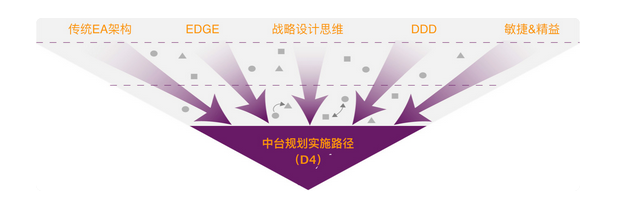

# 05 | D4模型：中台规划建设方法论概述

## 笔记

### 做一个业务中台和做一个分布式系统到底有什么不同?

面对的将是企业的业务全貌, 甚至是未来才会出现的潜在创新业务.

**面向用户与创新的平台型企业架构**

### 中台和EQ的区别

### 中台规划建设方法论: D4 模型

#### Discovery

建立全局视野.

多角度地理解企业的战略市场以及业务及IT全貌.

#### Define

对跨业务线的业务梳理进行重合度分析, 并结合领域分析对业务表象之后的企业核心问题域做进一步展开和重合度分析.

#### Desine

产品的愿景, 边界, 产品形态, 技术架构, 交付计划, 成本预估等等.

#### Delivery

交付

### 总结思考

中台背后的本质是**一个面向用户与创新的平台型企业架构的问题**.

* Think BIG
* Start Small
* Move Fast

## 扩展