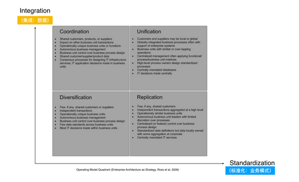
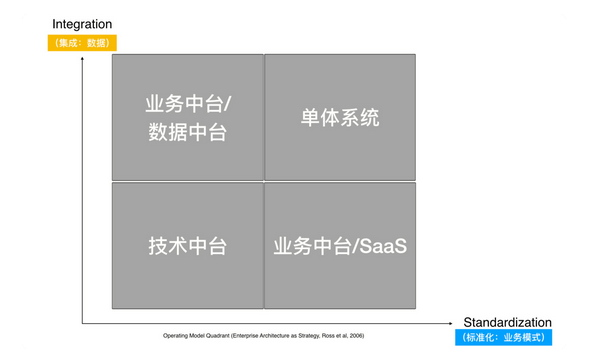

# 07 | 中台落地第二步：企业数字化全景规划（Define）

## 笔记

### 企业级架构方法

**TOGAF**的基本思路, 就是从企业最新的愿景战略以及运营模式触发, 设计企业的`To-Be`业务架构, 然后依次推导, 一步一步推导数据架构, 应用架构, 技术架构.

基于**Discovery**发散收集来的各个维度的信息, 在`Define`阶段结合自上而下企业战略分解的举措和**自上而下**现有业务架构梳理和分析的问题及痛点, 重新设计新的业务架构, 并进一步推导出其他的相关的架构设计.

中台从架构层面就是平台型的企业架构, 如何从企业整体的视角, 更准确地识别出多业务线之间的共性业务元素.

就像给业务照了一个B超一样, 帮助我们更好地透过现象看到内在的实质.

### 中台复用的能力类型到底有几种?

* 我们到底要在不同业务线中寻找哪几类共性能力?
* 我们经常讲的业务中台中的业务到底又具体指的是什么呢?
* 那为什么中台一般都是业务, 数据, 技术这三者的组合呢?

* 横轴代表标准化, 标准化越高, 可以简单理解成企业就是通过业务模式(业务功能 + 业务流程_的复用实现业务线的扩展.
* 纵轴代表集成, 可以理解成数据集成, 企业通过对数据的复用, 来实现业务线的扩展的.

**中台里的能力复用方式**只是复用了底层的技术部分.

* 业务流程, 数据一样: 单体
* 业务相似, 数据需要隔离开, 就是右下角区域

业务数据, 业务功能, 业务流程以及通用的技术能力.

### 通过领域分析识别共性能力

**领域驱动设计(DDD)**通过业务流程识别出能力复用场景.

### 中台与微服务有什么区别和联系

中台和微服务**没关系**.

* 业务中台解决的是业务领域的业务(数据, 功能, 流程)复用的问题.
* 微服务解决的是技术领域的**组件编译时依赖**造成的问题.

业务中台要解决的是业务能力如何快速复用的问题, 就算背后是一个大单体, 只要暴露出来的API能够满足业务能力快速复用的目的也是也可以的.

微服务架构是一种架构模式, 它提倡将单一应用程序划分成一组小的服务, 每个服务运行在其独立的进程中, 服务间采用轻量级的通信机制互相沟通(通常是基于HTTP协议的RESTful API). 每个服务都围绕着具体业务进行构建, 并且能够独立部署到生产环境, 类生产环境.

### 平台型企业架构设计概述

1. 首先通过各条业务线的现有业务架构分析, 再结合识别的痛点做的根因分析, 做业务架构上的改进与设计, 从而对现有的业务架构进行改进,设计出新的改进后的业务架构, 解决现在痛点背后的问题.
2. 参考战略分解后对各条业务线的目标和举措, 通入`To-Be`业务架构的设计当中, 使新的业务架构设计同时匹配企业战略要求以及解决短期战术痛点.
3. 对改进后的业务架构, 做跨业务线的比对和分析, 就能帮助我们发现不同业务线的业务功能及业务流程的**重叠情况**, 为后续中台建设的必要判断提供业务层面上的支撑和输入.
4. 使用领域驱动设计(DDD)的战略部分, 针对于每条业务线, 做问题域和限界上下文分析, 以及关键聚合的设备, 从而试图穿越流程, **从领域的角度深入一层审视业务的本质**, 到底是在解决哪些问题空间的问题, 并通过问题域的划分(核心, 通用, 支撑), 区分问题空间对于企业的重要性.
5. 类似于业务架构, 同样对于各条业务线分析出来的领域分析视图,做横向比对和投影, 从领域层设备不同的业务线中的问题域, 限界上下文以及聚合的重合度. 帮助我们识别业务数据以及业务模式(功能+流程)上的深层次共性能力.
6. 结合现有的业务架构及应用架构, 做各条线的应用架构设计改进， 并通过`As-is`和`To-Be`的应用架构做`Gap`分析, 传出`IT`建设的具体机会点.
7. 再基于跨域的业务架构分析和跨越的领域分析, 讨论判断多条业务线的业务重合度, 并详细识别冲恶化更多是在
	* 业务模式级别的重合(电商)
	* 业务功能级别重合(登录, 购物车)
	* 业务领域级别重合(用户数据打通)
8. 分析当前现状与`To-Be`的最终规划之间的差距, 产出具体的机会点列表, 并且基于多维度做优先级排序, 产出最终的路线图.

## 扩展