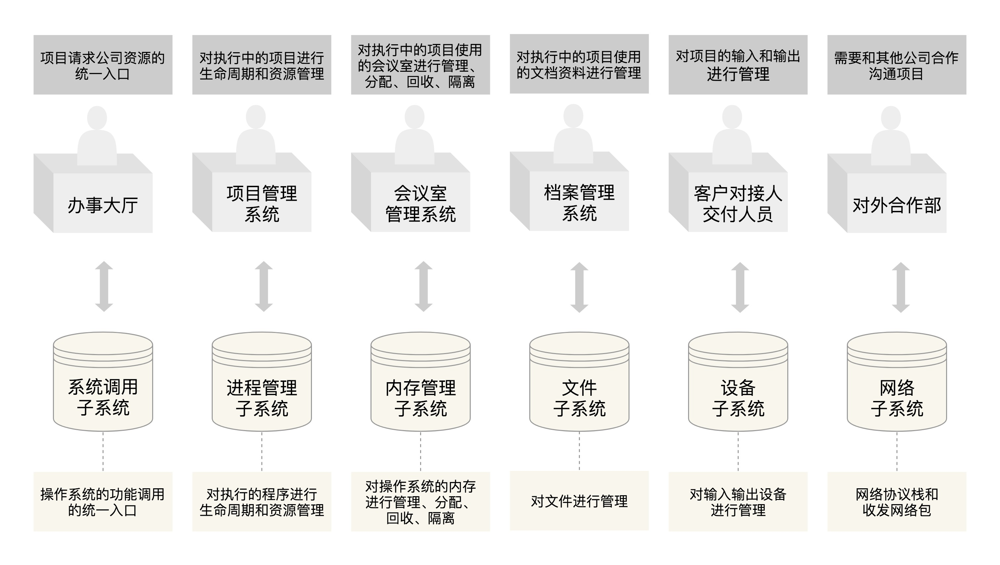

# 03 | 你可以把Linux内核当成一家软件外包公司的老板

## 学习

### 理解概念

操作系统其实就像一个软件外包公司, 其内核就相当于这家外包公司的老板. 所以接下来的整个课程中, 请你将自己的角色切换成这家软件外包公司的老板, 设身处地去理解操作系统是如何协调各种资源, 帮客户做成事情的.

* 用户: 是指操作系统的用户.
* 客户: 外包公司的客户.

### 双击QQ这个过程, 都需要用到哪些硬件

#### 输入设备

鼠标和键盘是计算机的**输入设备**.

用户移动了鼠标, 鼠标就会通过鼠标线给电脑发消息, 告知电脑, 鼠标向某个方向移动了多少距离.

对应到外包公司就是**客户对接员**,和客户说什么事情都找对接员.

#### 输出设备

屏幕, 是显示器, 是计算机的**输出设备**, 将计算机处理用户请求后的结果展现给客户.

限时抢上面显示的东西是由**显卡**控制的. 无论显示器还是显卡, 都有个"坐标"的概念.

比如鼠标移动, 本来在某个坐标画了一个鼠标箭头, 当接到鼠标移动的事件之后, 应该按相同的方向, 按照一定的比例(鼠标灵敏度), 在屏幕的某个坐标再画一个鼠标箭头.

#### 总结

**输入设备驱动**就是**客户对接员**. 当新插上一个鼠标的时候, 会弹出一个通知你安装驱动, 这**就是操作系统这家外包公司给你配备的对接人员**. 当客户告诉对接员需求的时候, 对于操作系统来讲, 输入设备会发送一个**中断**. 这个概念很好理解. **客户肯定希望外包公司把正在做的事情都停下来服务它**. 所以, 这个时候客户发送的需求就被称为**中断事件**(`Interrupt Event`).

### 从点击QQ图标, 看操作系统全貌

首先, 鼠标双击会触发一个中断, 相当于客户告知客户对接员"有了新需求, 需要处理一下". 你(老板)会事先把处理这种问题的方法教给客户对接员. 在操作系统里面就是调用中断处理函数. 操作系统发现双击是一个图标, 就明白了用户的原始诉求, 准备运行QQ和别人聊天.

运行`QQ`是一件大事, 因为将来的一段时间, 用户要一直和QQ进行交互. 相当于公司接了一个大单, 而不是处理零星的客户需求, 这个时候应该单独立项. 一旦立了项, 以后与这个项目有关的事情, 都有这个项目组来处理.

需要有**项目执行计划书**, 说明这个项目打算怎么做, 一步一步如何执行, 遇到什么情况应该怎么办等等. 换句话说, 对QQ这个程序来说, 它能做哪些事情, 每个事情怎么做, 先做啥后做啥, 都已经作为程序逻辑写在程序里面, 并且编译为二进制了. 这个程序就相当于项目执行计划书.

电脑上程序都以二进制文件形式保存在硬盘上. 硬盘是个物理设备, 要按照规定格式化成为文件系统, 才能存放这些程序. 文件系统需要一个系统进行统一管理, 称为**文件管理子系统(File Management Subsystem)**

#### 程序和进程

公司, 项目立的多了, 项目执行计划书也会很多, 同样需要有个统一保存文件的档案库, 而且需要有序地管理起来.

当你从资料库里面拿到这个项目执行计划书, 接下来就需要开始执行这个项目了. **项目执行计划书是静态的, 项目的执行是动态的**.

当操作系统拿到`QQ`的二进制执行文件的时候, 就可以运行这个文件了. `QQ`的二进制文件是静态的, 称为**程序(Program)**, 而运行起来的QQ, 是不断进行的, 称为**进程(Process)**.

权衡:

* 资源有限, 甚至是涉及机密, 不能由项目组滥取滥用.
	* 涉及核心权限的资源, 应该被公司严格把控, 审批了才能用.
* 效率, 保证项目申请资源的时候只跑一次.
	* 为了提高效率, 最好有个统一的办事大厅, 明文列出提供哪些服务, 谁需要可以来申请, 然后就会有回应.

操作系统中, 如果有多个进程要往打印机上打印文件, 如果随便乱打印进程, 就会出现同一张纸, 第一行是`A`进程输出的文字, 第二行是`B`进程输出的文字. 

所以, 打印机的直接操作是放在操作系统内核里面的, 进程不能随便操作. 但是操作系统也提供一个办事大厅, 也就是**系统调用(System Call)**.

系统调用也能列出来提供哪些接口可以调用, 进程有需要的时候可以去调用. 这其中, 立项是办事大厅提供的关键服务之一. 同样, 任何一个程序要想运行起来, 就需要调用系统调用, 创建进程.

操作系统中, 进程的执行也需要分配`CPU`进行执行, 也就是按照程序里面的二进制代码一行一行地执行. 于是, 为了管理进程, 还需要一个**进程管理子系统(Process Management Subsystem)**. 如果运行的进程很多, 则一个CPU会并发运行多个进程, 也就需要CPU的调度能力了.

不同项目的办公空间需要隔离. 把不同的项目组分配到不同的会议室. 会议室是有限的, 需要有人管理和分配, 需要一个**会议室管理系统**.

操作系统中, 不同的进程由不同的内存空间, 但是整个电脑内存就那么点, 所以需要统一的管理和分配, 这就需要**内存管理子系统(Memory Management Subsystem)**.

### 总结

## 扩展