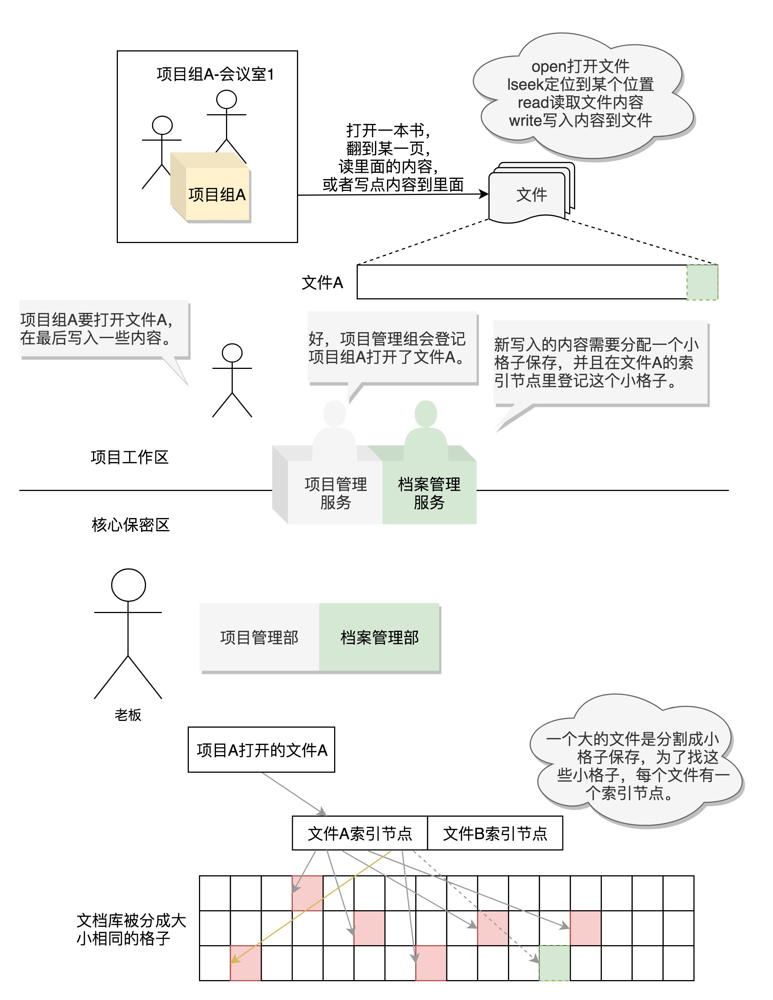

# 05 | 学会几个系统调用：咱们公司能接哪些类型的项目？

## 笔记

系统调用决定了这个操作系统好用不好用.

### 立项服务于进程管理

首先, 我们有个项目, 就要有立项服务. 对应到`Linux`操作系统中就是**创建进程**

创建进程的系统调用叫`fork`.

在`Linux`里, 创建一个新的进程, 需要一个老的进程调用`fork`来实现, 其中老的进程叫做**父进程**(`Parent Process`), 新的进程叫做**子进程**(`Child Process`).

一个项目的执行是很复杂的.

一种方式是**列一个清单**, 清单里写明每个新项目组都要开哪些账号. 但是这样每次有项目都要配置一遍新的.

另一种方式是, `CTRL/C + CTRL/V`, 也即是说, 拷贝一个别人的, 然后根据新项目的实际情况, 将相应的配置改改.

当父进程调用`fork`创建进程的时候, 子进程将各个子系统为父进程创建的数据结构也全部拷贝了一份, 甚至连程序代码也是拷贝过来的. **如果不进行特殊的处理, 父进程和子进程都按相同的程序代码进行下去, 这样就没有意义了**.

往往会这样处理: 对于`fork`系统调用的返回值:

* 如果当前进程是子进程, 就返回0.
* 如果当前进程是父进程, 就返回子进程的进程号.

如果是:

* 父进程, 就接着做原来应该做的事情
* 子进程, 需要请求另一个系统调用`execve`来执行另一个程序

**这个时候, 子进程和父进程就彻底分道扬镳了, 也即产生一个分支(`fork`)了**.

操作系统, 启动的时候先创建一个所有用户进程的**祖宗进程**.

有的时候父进程要关心子进程的运行情况. 通过系统调用`waitpid`, 父进程可以调用它, 将子进程的进程号作为参数传给它, 这样父进程就知道子进程运行完了没有, 成功与否.

**所以, 所有子项目最终都是老板, 也就是祖宗进程`fork`过来的, 因而它要对整个公司的项目执行负最终责任**.

### 会议室管理与内存管理

操作系统中, 每个进程都有自己的内存, 互相之间不干扰, 有独立的**进程内存空间**.

进程内存空间中, 放**程序代码**的这部分, 称为**代码段(Code Segment)**.

进程运行中产生数据的这部分, 称为**数据段(Data Segment)**, 局部变量的部分, 在当前函数执行的时候起作用, 当进入另一个函数时, 这个变量就释放了. (项目执行过程中, 开会讨论画在白板上的东西, 进入下个主题就擦了).

有**动态分配**的, 会较长时间保存, 指明才销毁的, 称为**堆(Heap)**. (项目执行过程中, 画在纸和本子上, 讨论的时候翻出来, 会议记录, 不讨论的时候就堆在那里, 会保留比较长的一段时间, 除非指明的确不需要了才销毁).

一个进程的内存空间, 32位是4G, 64为就更大了. **不是事先分配好的, 是需要的时候再分配**.

进程自己不用的部分就不用管, 进程要去使用部分内存的时候, 才会使用内存管理的系统调用来登记, 说自己马上就要用了, 希望分配一部分内存给它. **只有真的写入数据的时候, 发现没有对应物理内存, 才会触发一个中断, 现分配物理内存**.

* 执行计划: 代码段
* 架构图: 数据段
* 会议记录: 堆

**堆**里面分配内存的系统调用:

* brk
* mmap

#### brk(分配较小内存)

当分配的内存数量较小的时候,使用`brk`.

会和原来的堆的数据连在一起, 这就像多分配两三个工位, 在原来的区域旁边搬两把椅子就行了.

#### mmap(分配较大内存)

当分配的内存数量比较大的时候, 使用`mmap`, 会重新划分一块区域. 也就是说, 当办公室空间需要太多的时候, 索性来个一整块.

### 档案库管理与文件管理

项目执行计划书要保存在档案库里, 有一些需要长时间保存, 这样哪怕公司暂时停业, 再次经营的时候还可以继续使用. 关机在开机也能不丢的, 就需要放在文件系统里面.

文件可以做到这一点, 因为如下两方面:

* **介质**
* **格式**

文件操作:

* 对于已经有的文件, 可以使用`open`打开这个文件, `close`关闭这个文件.
* 对于没有的文件, 可以使用`creat`创建文件
* 打开文件以后, 可以使用`lseek`跳到文件某个位置
* 可以对文件内容进行读写, `read`和`write`

**Linux, 一切皆文件**

* 启动一个进程, 需要一个程序文件, 这是一个**二进制文件**.
* 启动的时候, 要加载一些配置文件, 例如`yml, properties`等，这是文本文件; 启动之后打印一些日志, 如果写到硬盘上, 也是**文本文件**.
* 把日志打印到交互控制台上, 在命令行上打印出来, 也是一个文件, **标准输出stdout文件**.
* 进程的输出可以作为另一个进程的输入, 称为**管道**, 管道也是一个文件.
* 进程需要访问外部设备, **设备**也是一个文件.
* 文件都被存储在文件夹里面, **文件夹**也是一个文件
* 进程运行起来, 要想看进程运行的情况, 会在`/proc`下面有对应的**进程号**, 也是文件.

每个文件, Linux 都会分配一个**文件描述符(File Descriptor)**, 这是一个整数. **有了这个文件描述符, 就可以使用系统调用, 查看或者干预进程运行的方方面面**.

### 项目异常处理与信号处理

项目遇到异常情况, 做到一半不做了, 就需要发送一个**信号(Signal)**, 常见信号:

* `CTRL + C`, 中断信号
* 非法访问内存(跑到别人会议室, 看到不该看的东西)
* 硬件故障
* 用户进程通过`kill`, 讲一个**用户信号发送给另一个进程**

对于一些不严重的信号, 可以忽略, 但是像`SIGKILL`(用于终止一个进程的信号)和`SIGSTOP`(用于中止一个进程的信号)是不能忽略的m 可以执行对于该信号的**默认动作**.

每种信号都定义了默认的动作, 也可以提供信号处理函数, 通过`sigaction`系统调用, 注册一个信号处理函数.

系统了信号处理服务, 项目执行过程中一旦有变动, 就可以及时处理.

### 项目组间沟通与进程通信

项目较大的时候, 分成多个项目组, 不同的项目组需要相互交流, 相互配合才能完成.

#### 1. 消息队列

发个消息, **不需要一段很长的数据**. 这个消息队列是内核里的

* 可以通过`msgget`创建一个队列
* `msgsnd`将消息发送到消息队列
* `msgrcv`从队列中取消息

#### 2. 共享内存

需要交互的信息比较大的时候, 两个项目组共享一个会议室(数据不需要拷贝来拷贝去). 大家都到这个会议室来, 就可以完成沟通了.

* `shmget`创建一个共享内存
* `shmat`将共享内存映射到自己的内存空间就可以读写了

#### 竞争问题 

两个项目组共同访问一个会议室里的数据, 就会存在**竞争**. 如果大家同时修改同一块数据咋办, 需要一种方式, 让不同的人能够排他地访问, **信号量的机制Semaphore**.

对于只允许一个人访问的需求, 我们可以将信号量设为1. 当一个人要访问的时候, 先调用`sem_wait`. 如果这时候没有人访问, 则占用这个信号量, 他就可以开始访问了. 如果这个时候另一个人也要访问, 也会调用`sem_wait`. 由于前一个人已经在访问了, 所有后面这个人就必须等待上一个人访问之后才能访问. 当上一个人访问完毕后, 会调用`sem_post`将信号量释放, 于是下一个人等待结束, 可以访问这个资源了.

### 公司间沟通与网络通信

这台`Linux`要和另一台`Linux`交流, 这时候, 我们就需要用到网络服务.

不同机器的网络相互通信, 要遵循相同的网络协议, 也即**TCP/IP网络协议栈**. 

网络服务是通过套接字`Socket`来提供服务的. 可以想象成弄一根网线, 一头插在客户端, 一头插在服务端, 然后进行通信. 通信之前, 双方都要建立一个`Socket`.

`Socket`也是一个文件, 也有一个文件描述符, 也可以通过读写函数进行通信.

### 查看源代码中的系统调用

### 中介与`Glibc`

使用中介`Glibc`, 转换成为系统调用, 帮你调用.

**Glibc为程序员提供丰富的API, 除了例如字符串处理, 数学运算等用户态服务之外, 最重要的是封装了操作系统提供的系统服务, 即系统调用的封装**

每个特定的系统调用对应至少一个`Glibc`封装的库函数. 比如, 系统提供的打开文件系统调用`sys_open`对应的是`Glibc`中的`open`函数.

`Glibc`一个单独的`API`可能调用多个系统调用, 比如说, `Glibc`提供的`printf`函数就会调用如`sys_open, sys_mmap, sys_write, sys_close`等等系统调用.

多一个API也可能只对应同一个系统调用， 如`Glibc`下实现的`malloc`, `calloc`, `free`等函数用来分配和释放内存, 都利用了内核的`sys_brk`的系统调用.

## 扩展