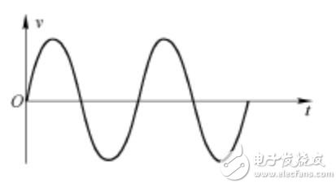
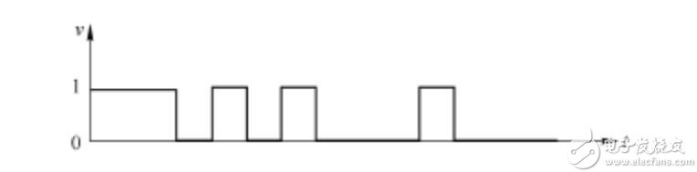

# 第23讲 | 移动网络：去巴塞罗那，手机也上不了脸书 

## 笔记

### 2G网络

`2G`时代上网使用的不是`IP`网络, 而是电话网络, 走**模拟信号**. 被称为**公共交换电话网(PSTN, Public Switched Telephone Network)**

#### 手机怎么上网

收集是通过**收发无线信号**来通信的. 专业名称是`Mobile Station`, 简称`MS`, 需要嵌入`SIM`.

* 手机是客户端
* **基站子系统(BSS, Base Station SubsystemBSS)**是服务端

山里的信号塔就是基站, 通过无线信号, 让手机可以通信.

**无论无线通信如何无线, 最终还是要连接到有线的网络里**

基站子系统分成两部分

* 对外提供无线通信：基站收发信台(BTS, Base Transceiver Station)
* 对内连接有线网络: 基站控制器(BSC, Base Station Controller)

**基站收发信台通过无线收到数据后, 转发给基站控制器**, 这部分属于无线的部分, 统称为**无线接入网(RAN, Raido Access Network)**.

基站控制器通过有线网络, 连接到提供手机业务的运营商的数据中心, 这部分称为**核心网(CN, Core Network)**, **核心网还没有真的进入互联网**, 这部分还是主要提供手机业务, 是手机业务的有线部分.

接待基站来的数据是移动业务交换中心**(MSC, Mobile Service Switching Center)**, 它是进入核心网的入口. **不会让你直接连接到互联网上**

认证是不是合法手机, **鉴权中心(AUC, Authentication Center)和设备识别寄存器(EIR, Equipment Identify Register)主要是负责安全性**

计费, 检查是不是外地号. **访问位置寄存器(VLR, Visit Location Register)是看你目前在的地方**, **归属位置寄存器(HLR, Home Location Register)是看你的号码归属地**

上网: 需要一个网关, 连接核心网和真正的互联网. **网关移动交换中心(GMSC, Gateway Mobile Switching Center)**, 然后是真正的互联网.

数据中心里面的这些模块统称为**网络子系统(NSS, Network and Switching Subsystem)**.

#### 2G网络特点

* 手机通过无线信号连接基站
* 基站
	* 超前接无线
	* 朝后接核心网
* 核心网
	* 超前接到基站请求
		* 判断你是否合法
		* 判断你是不是本地号码
		* 有没有钱
	* 通过网关连接电话网络

### 2.5G网络

原来电路交换的基础上, 加入了**分组交换业务**, 支持`Packet`的转发, 从而**支持IP网络**.

基站:

* 一面超前接无线
* 一面朝后接核心网
	* 多了一个分组控制单元(PCU, Packet Control Unit), 提供分组交换通道

核心网:

* **朝前**接待员(SGSN, Service GPRS Supported Node)
* **朝后**链接`IP`网络的网关型`GPRS`支持节点(GGSN, Gateway GPRS Supported Node).

### 3G网络

无线通信技术有了改进, 增加了无线的宽带.

`W-CDMA`为例, 理论最高2M的下行速度. 基站改变了.

* 朝外的是`Node B`
* 朝内链接核心网的是**无线网络控制器(RNC, Radio Network Controller)**.

### 4G网络

基站为**`eNodeB`**, 包含了原来`Node B`和`RNC`的功能.

核心网络实现了**控制面**和**数据面**的分离.

原先前面有**MSC(2G)**或**SGSN(2.5, 3G)**, 检查是否合法以及转发数据都是它负责. **控制面和数据面是合二为一的**, 灵活性比较差.

* 控制面主要是指令, 多是**小包**, 需要高的及时性
* 数据面主要是流量, 多是**大包**, 需要吞吐量

于是有了下面这个架构:

`HSS`用于存储用户签约信息的数据库, 这个号码的归属地, 以及一些认证信息.

`MME`是核心控制网元, 是控制面的核心, 当手机通过`eNodeB`连上的时候, **`MME`会根据`HSS`的信息, 判断你是否合法**. 如果允许连上来, `MME`不负责具体的数据流量, 而是`MME`会选择数据面的`SGW`和`PGW`, 然后告诉`eNodeB`, 我允许你连上来, 你连接它们吧.

当手机直接通过`eNodeB`连接`SGW`, 连上核心网, **`SGW`相当于数据面的接待员**, 并通过`PGW`连到`IP`网络, **PGW 就是出口网关**. 在出口网关, 有一个组件`PCRF`, 称为策略好计费控制单元, 用来控制上网策略和流量的计费.

### 4G 网络协议解析

 
### 控制面协议

**虚线**部分是控制面的协议. 

* 手机想上网
* 链接`eNodeB`
* 通过`S1-MME`接口, 请求`MME`对这个手机进行认证和鉴权

`S1-MME`协议栈如下:

 
* `UE`是收集
* `eNodeB`
	* 朝前对接无线网络
	* 朝后对接核心网络
* 控制面对接的是`MME`

`eNodeB`和`MME`之间的连接就是正常的`IP`网络. 在`IP`层上是`SCTP`(既不是`TCP`, 也不是`UDP`).

`SCTP`是传输层的协议, 也是面向连接的, 更加适合移动网络. 继承了`TCP`较为完善的拥塞控制并改进了一些不足之处.

#### SCTP - 多宿主

第一个特点是多宿主. 

一台机器可以有多个网卡. 虽然`TCP`可以监听`0.0.0.0`也就是从哪个网卡来的连接都能接收, 但是一旦建立连接, 就建立了四元组, 也就选定了某个网卡.

#### SCTP - 将一个联合分成多个流

`SCTP`引入了**联合(association)的概念**, 将多个接口, 多条路径放到一个联合中来. 当检测到一条路径失效时, 协议就会通过另外一条路径来发送通信数据. 应用程序不必知道发生了故障, 恢复, 提高了**可用性**和**可靠性**.

一个联合中的所有流都是独立的, 但均与该联合相关. 每个流都给定了一个流编号, 被编码到`SCTP`报文中, 通过联合在网络上传送. 

* TCP中, 由于强制顺序, 导致前一个不到达, 后一个就等待.
* SCTP 的多个流不会相互阻塞.

#### SCTP - 四次握手, 防止SYN攻击

`TCP`是三次握手, **当服务端收到客户的`SYN`之后, 返回一个`SYN-ACK`之前, 就建立数据结构, 并记录下状态, 等待客户端发送`ACK`的`ACK`**.

当恶意客户端使用虚假的源地址来伪造大量`SYN`报文时, 服务端需要分配大量的资源, 最好耗尽资源, 无法处理新的请求.

`SCTP`通过四次握手引入`Cookie`的概念, 来有效的防止这种攻击.

* 客户机使用一个`INIT`报文发起一个连接.
* 服务器使用一个`INIT-ACK`报文进行响应, 包括了`Cookie`.
* 客户端使用一个`COOKIE-ECHO`报文进行响应, 包含了服务器所发送的`Cookie`.
* **这个时候**, 服务器为这个连接分配资源, 并通过向客户机发送一个`COOKIE-ACK`报文对其响应.

#### SCTP - 消息分帧

`TCP`是面向流的, 也即发送的数据没头没尾, 没有明显的界限.

发送数据没问题, 但是对于发送一个个消息类型的数据, 不太方便. 可能客户端写入10个字节, 再写入20个字节. 服务端不是读出10个字节的一个消息, 再读出20个字节的一个消息. 而是有可能读入 25 个字节, 再读入 5 个字节, 需要**业务层去组合成消息**.

`SCTP`借鉴了`UDP`的机制, 在数据传输中提供了消息分帧功能. **当一端对一个套接字执行写操作时, 可确保对等端读出的数据大小与此相同**

#### SCTP - 断开连接是三次挥手

`SCTP`: 当一端关闭自己的套接字时, 对等的两端全部需要关闭, 将来任何一端都不讯再进行数据的移动了.

#### 数据通路

当`MME`通过认证鉴权, 同意这个手机上网的时候, 需要**建立一个数据面的数据通路**.

建立通路的过程还是**控制面**的事情, 因而使用的是控制面的协议`GTP-C`.

建设的数据通路分两段路, **两个隧道**.

* 第一段是`eNodeB`到`SGW`
	* 由`MME`通过`S1-MME`协议告诉`eNodeB`. 它是隧道一端.
	* 通过`S11`告诉`SGW`，它是隧道的另一端.
* 第二段是`SGW`到`PGW`.
	* `SGW`通过`S11`协议知道自己是其中一端, 并主动通过`S5`协议, 告诉`PGW`它是隧道的另一端.

`GTP-C`协议是基于`UDP`的.

 
`GTP`的头里面有隧道id, 还有序列号. **通过序列号**, 不用TCP, GTP-C 自己就可以实现可靠性, 为每个输出信令消息分配一个一次递增的序列号, 以确保信令消息的按序传递, 并便于检测重复包. 对于每个输出信令消息启动定时器, 在定时器超时前未接收到响应消息则进行重发.
 
### 数据面协议

当两个隧道都打通, 接在一起的时候, `PGW`会给收集分配一个`IP`地址, 这个IP地址是隧道内部的IP地址, 可以类别为`IPsec`协议里面的IP地址. 这个IP地址是归收集运营商管理的. 

手机使用这个IP地址, 连接eNodeB, 从eNodeB经过`S1-U`协议, 通过第一段隧道到达`SGW`, 再从`SGW`经过`S8`协议, 通过第二段隧道到达`PGW`, 然后通过`PGW`连接到互联网.

数据面协议都是通过`GTP-U`

手机每发出一个包, 都由GTP-U隧道协议封装起来, 格式如下.

* 乘客协议是手机发出来的包, IP是手机的IP
* 隧道协议里面有隧道ID, 不同的手机上线会建立不同的隧道, 因而需要隧道ID来标识
* 承载协议的IP地址是`SGW`和`PGW`的IP地址.

### 手机上网流程

手机开机上网的流程, 这个过程称为`Attach`.

1. 手机开机后, 在附近**寻找基站`eNodeB`, 给`eNodeB`发送`Attach Request`, 说: 我来啦, 我要上网.
2. `eNodeB`将请求发给`MME`, 说"有个手机要上网"
3. `MME`去请求手机, 认证和鉴权, 还会请求`HSS`看看有没有钱, 看看是在哪里上网
4. `MME`通过收集的认证之后, 开始**分配隧道**，先告诉`SGW`, 说要创建一个会话(Create Session). 会给`SGW`分配一个隧道ID**`t1`**, 并且请求`SGW`给自己也分配一个隧道`ID`. 
5. `SGW`转头向`PGW`请求建立一个会话, 为`PGW`的控制面分配一个隧道ID**`t2`**, 也给数据面分配一个隧道ID**`t3`**, 并且请求`PGW`给自己的控制面和数据面分配隧道ID.
6. `PGW`回复`SGW`说"创建会话成功", 使用自己的控制面隧道ID**`t2`**, 回复里面携带这给`SGW`控制面分配的隧道ID**`t4`**和数据面的隧道ID**`t5`**, 至此`SGW`和`PGW`直接的隧道建设完成. 双方请求对方, 都要带着对方给自己分配的隧道ID, 从而**标志是这个手机的请求**.
7. 接下来`SGW`回复`MME`说**创建会话成功**, 使用自己的隧道ID`t1`访问`MME`, 回复里面有给`MME`分配隧道ID**`t6`**, 也有`SGW`给`eNodeB`分配的隧道ID**`t7`**.
8. 当`MME`发现后面的隧道都建设成功之后, 就告诉`eNodeB`, “后面的隧道已经建设完毕", `SGW`给你分配的隧道ID是**`t7`**, 你可以开始连上来了, 但是你也要给`SGW`分配一个隧道.
9. `eNodeB`告诉`MME`自己给`SGW`分配一个隧道, ID为**`t8`**.
10. `MME`将`eNodeB`给`SGW`分配的隧道ID`t8`告知`SGW`, 从而前面的隧道也建设完毕.

### 异地上网

* `SGW`是本地的运营商设备
* `PGW`是所属的运营商的设备

国外上网:

* 搜索本地`eNodeB`
* 通过`MME`去查寻国内运营商的`HSS`, 检查是否合法, 有钱.
* 如果可以上网, 收集和国外的`SGW`建立一个隧道
* 国外的`SGW`和国内运营商的`PGW`建立一个隧道, 通过国内运营商的`PGW`上网

* 能否上网是国内运营商的`HSS`
* 控制上网策略的是国内运营商的`PCRF`
* 给手机分配的`IP`地址也是国内运营商的`PGW`负责
* 上网流量全部通过国内运营商即可
* 国外运营商也要和国内运营商进行流量结算

**由于上网策略是由国内运营商在PCRF中控制的, 所以还是上不了脸书**.

## 扩展

### SYN攻击

`TCP`是三次握手, **当服务端收到客户的`SYN`之后, 返回一个`SYN-ACK`之前, 就建立数据结构, 并记录下状态, 等待客户端发送`ACK`的`ACK`**.

当恶意客户端使用虚假的源地址来伪造大量`SYN`报文时, 服务端需要分配大量的资源, 最好耗尽资源, 无法处理新的请求.

### 模拟信号

模拟电压信号在时间上和幅值上均是连续的信号叫做模拟信号. 此类信号的特点是,在一定动态范围内幅值可取任意值. 许多物理量,例如声音、压力、温度等均可通过相应的传感器**转换为时间连续, 数值连续的电压或电流**.

随时间变化的模拟电压信号.

### 数字信号

与模拟信号相对应,时间和幅值均离散(**不连续**)的信号叫做数字信号. 数字信号的特点是幅值只可以取有限个值.

