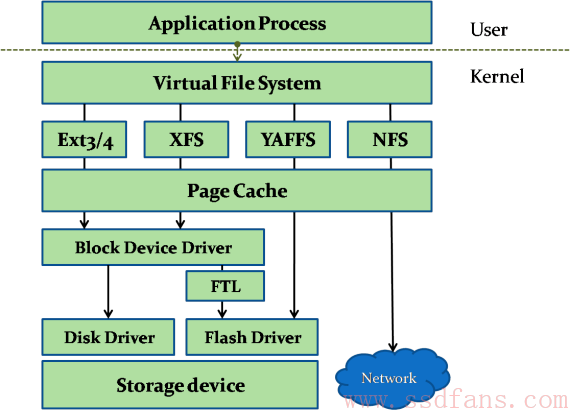

# 第32讲 | RPC协议综述：远在天边，近在眼前

## 笔记

服务之间如何通信? `socket`?

### 如何解决这五个问题?

#### 问题一: 如何规定远程调用的语法

#### 问题二: 如何传递参数

#### 问题三: 如何表示数据

最低位放在最后一个位置, 叫做`Little Endian`, 最低位放在第一个位置, 叫做`Big Endian`. `TCP/IP`协议栈是按照`Big Endian`来设计的, 而`x86`机器多按照`Little Endian`来设计的, 因为发出去的时候需要做一个转换.

#### 问题四: 如何知道一个服务端都实现了哪些远程调用? 从哪个端口可以访问这个远程调用?

假设服务端实现了多个远程调用, 每个可能是现在不同的进程中, 监听的端口也不一样. 为了防止冲突, 往往使用随机端口, 那么客户端如何找到这些监听的端口呢?

#### 问题五: 如果发生了错误, 重传, 丢包, 性能等问题怎么办?

同一个连接中，可以通过`TCP`协议来保证丢包, 重传的问题, 但是如果服务器崩溃了又重启, 当前连接断开了, `TCP`就暴增不了了. 

### 协议约定问题

本地调用函数有很多问题, 比如词法分析, 语法分析, 语义分析等等. 这些编译器本来都帮你做了. 但是**在远程调用中, 这些问题你都需要重新考虑**.

**RPC框架**

当客户端的引用想发起一个远程调用时, 它实际是通过本地调用本地调用方的`Stub`. 它负责将调用的接口, 方法和参数, 通过约定的协议规范进行编码, 并通过本地的`RPCRuntime`进行传输, 将调用网络包发送到服务器.

服务端的`RPCRunitime`收到请求后, 交给提供方`Stub`进行解码, 然后调用服务端的方法, 服务端执行方法, 返回结果, 提供方`Stub`将返回结果编码后, 发送给客户端, 客户端的`RPCRuntime`收到结果，发给调用方`Stub`解码得到结果, 返回给客户端.

* 本地调用: 专注于业务逻辑的处理
* Stub层, 处理双方约定好的语法, 语义, 封装, 解封装.
* RPCRuntime, 处理高性能的传输, 以及网络的错误和宜昌.

`Sun RPC(ONC RPC)`是在`NFS`协议中使用的.

`NFS(Network File System)`就是网络文件系统. 要是`NFS`成功运行, 要启动两个服务端.

* `mountd`, 用来挂载文件路径
* `nfsd`, 用来读写文件.

`NFS`可以在本地`mount`一个远程的目录到本地的一个目录, 从而本地的用户在这个目录里面写入, 读出任何文件的时候, 其实操作的是远程另一台机器上的we你按.

**NFS协议就是基于RPC实现的. 无论是什么RPC, 底层都是Socket编程**

`XDR(External Data Representation, 外部数据表示法)`是一个标准的数据压缩格式, 可以表示基本的数据类型, 也可以表示结构体.

在`RPC`的调用过程中, 所有的数据类型都要封装成类似的格式. 而且`RPC`的调用和结果返回, 也有严格的格式.

* `XID`唯一标示一对请求和回复. 请求为0, 回复为1.
* `RPC`有版本号, 两端要匹配`RPC`洗衣的版本号. 如果不匹配, 就会返回`Deny`, 原因就是·RPC_MISMATCH`.
* 程序有编号, 找不到返回`PROG_UNAVAIL`
* 程序有版本号, 程序版本号不匹配, 就会返回`PROG_MISMATCH`
* 一个程序可以有多个方法, 方法也有编号, 如果找不到方法, 就会返回`PROC_UNAVAIL`
* 调用需要认证鉴权, 如果不通过, 则`Deny`.
* 参数列表, 参数无法解析, 返回`GARBAGE_ARGS`

为了可以成功调用`RPC`, 在客户端和服务端实现`RPC`的时候, 首先要定义一个双方都认可的程序, 版本, 方法, 参数等.

有了协议定义文件， `ONC RPC`会提供一个工具, 根据这个文件生成客户端和服务器端的`Stub`程序.

最下层是`XDR`文件, 用于编码和解码参数. 这个文件是客户端和服务端共享的， 因为只有双方一致才能成功通信.

在客户端, 会调用`clnt_create`创建一个连接, 然后调用`add_1`, 这是一个`Stub`函数, 感觉是在调用本地一样. 其实是这个函数发起了一个`RPC`调用, 通过调用`clnt_call`来调用`ONC RPC`的类库, 来真正发送请求. 

服务端也有一个`Stub`程序, 监听客户端的请求, 当调用到达的时候, 判断如果是`add`, 则调用真正的服务器逻辑, 也即将两个数加起来.

服务端将结果返回服务端的`Stub`, 这个`Stub`程序发送结果给客户端, 客户端的`Stub`程序正在等待结果, 当结果到达客户端`Stub`, 就将结果返回给客户端的应用程序, 从而完成整个调用过程.

这个`RPC`框架解决了:

* 如何规定远程调用的语法
* 如何传递参数
* 如何表示数据

### 传输问题

传输问题由`ONC RPC`的类库来实现.

这个类库, 为了解决传输问题, 对于每一个客户端, 都会创建一个传输管理层, 而每一次`RPC`调用, 都会是一个任务, 在传输管理层, 你可以看到熟悉的队列机制, 拥塞窗口机制等.

网络传输经常需要等待, **同步方式效率较低**, `Socket`的异步模型. 为了能够异步处理, 对于远程调用的处理, 往往是通过状态机来实现的. 只有当满足某个状态的时候, 才进行下一步, 如果不满足状态, **不是在那里等, 而是将资源留出来, 用来处理其他RPC调用**.

### 服务发现问题

在`ONC RPC`中, 服务发现是通过`portmapper`实现的.

`portmapper`会启动在一个众所周知的端口上, `RPC`程序由于是用户自己写的, 会监听在一个随机端口上, 但是`RPC`程序启动的时候, 会向`portmapper`注册. 客户端要访问`RPC`服务端这个程序的时候, 首先查询`portmapper`, 获取`RPC`服务端程序的随机端口, 然后向这个司机端口建立链接, 开始`RPC`调用.

## 扩展

`NFS`也是基于`VFS`文件系统.

